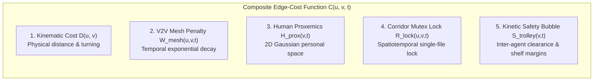

# $\text{D}^2\text{RO}$ / SW-DGO Framework
### Socially-Weighted Distributed Graph Optimization for Autonomous Multi-Agent Service Fleets

[](https://www.python.org/)
[-0ea5e9.svg)]()
[]()
[]()

---

## 📌 Executive Summary

**$\text{D}^2\text{RO}$ (Decentralized Dynamic Routing and Optimization)** powered by **SW-DGO (Socially-Weighted Distributed Graph Optimization)** is a novel multi-agent navigation framework designed for autonomous service fleets operating in dense, dynamic, human-shared environments (such as retail supermarkets, hospitals, and airport terminals).

Traditional Multi-Agent Path Finding (MAPF) and reactive obstacle avoidance algorithms suffer from:
1. **Local Minima & Shelf Traps:** Pure potential field/ORCA methods get trapped in U-shaped and L-shaped corridor corners formed by solid orthogonal fixtures.
2. **Live-Locks in Narrow Corridors:** Two opposing agents meeting in a single-file corridor freeze in permanent symmetrical avoidance loops.
3. **Discomfort Violations:** Treating humans as rigid static obstacles causes robots to invade personal space or cut off pedestrians.
4. **Information Isolation:** Agents fail to share dynamic blockage/congestion intelligence, leading trailing units to repeatedly enter jammed corridors.

$\text{D}^2\text{RO}$ resolves these challenges through **incremental graph search ($D^*$ Lite)**, **peer-to-peer V2V mesh networking**, **continuous Gaussian proxemics**, **spatiotemporal corridor mutex locks**, and **kinetic vehicle safety envelopes**.

---

## 📐 Mathematical Formulation: The 5-Component SW-DGO Cost

The core of SW-DGO is the dynamic composite edge-cost function $C(u, v, t)$, which maps physical, communicative, social, and kinetic constraints into a unified scalar cost evaluated by each agent's local $D^*$ Lite planner:

$$\boxed{C(u, v, t) = D(u, v) + W_{\text{mesh}}(u, v, t) + H_{\text{prox}}(v, t) + R_{\text{lock}}(u, v, t) + S_{\text{trolley}}(v, t)}$$



### 1. Baseline Kinematic Distance: $D(u, v)$
$$D(u, v) = \|\mathbf{p}_u - \mathbf{p}_v\|_2 + \alpha_{\text{turn}} |\Delta \theta|$$
Calculates the physical Euclidean transition distance between node $u$ and node $v$ with a penalization weight $\alpha_{\text{turn}}$ for sharp turns. Movement into a solid fixture evaluates to $\infty$.

### 2. V2V Mesh Network Congestion Penalty: $W_{\text{mesh}}(u, v, t)$
$$W_{\text{mesh}}(u, v, t) = \sum_{k \in \mathcal{M}(u, v, t)} \gamma_k \cdot \exp(-\lambda_{\text{decay}} (t - t_k))$$
Represents temporary blockages or crowds detected by peer agents and broadcasted across the decentralized wireless mesh within communication radius $R_{\text{mesh}} = 350\text{px}$ (multi-hop TTL relay). Trailing agents receive telemetry and proactively detour before entering congested aisles.

### 3. Human Proxemic Discomfort Field: $H_{\text{prox}}(v, t)$
$$H_{\text{prox}}(\mathbf{p}, t) = \sum_{i} A \cdot \exp\left( -\frac{\|\mathbf{p} - \mathbf{h}_i(t)\|^2}{2\sigma^2} \right)$$
Models the psychological personal-space comfort bubble around human pedestrians sensed via on-board LiDAR/RGB-D ($A = 50.0\text{ discomfort units}$, $\sigma = 1.5\text{m}$). Evaluated continuously along edge line segments.

### 4. Directional Corridor Mutex Lock: $R_{\text{lock}}(u, v, t)$
$$R_{\text{lock}}(u, v, t) = \begin{cases} \infty, & \text{if opposing edge } (v, u) \text{ is locked by another agent at time } t \\ 0, & \text{otherwise} \end{cases}$$
Enforces strict mutual exclusion in single-file corridors ($w_{\text{aisle}} < 2 r_{\text{trolley}}$) to eliminate head-on deadlocks and live-locks.

### 5. Trolley Kinetic Safety Clearance Envelope: $S_{\text{trolley}}(v, t)$
$$S_{\text{trolley}}(\mathbf{p}, t) = \sum_{j \neq \text{self}} A_{\text{trolley}} \cdot \exp\left( -\frac{\|\mathbf{p} - \mathbf{t}_j(t)\|^2}{2\sigma_{\text{trolley}}^2} \right)$$
Maintains kinetic following distances between moving carts (preventing tailgating) and enforces an $18\text{px}$ safety margin around shelf corners so carts never scrape or slam into fixtures.

---

## 🏬 Three Multi-Domain Desktop Simulators (100% Pure Python)

The framework includes **three native desktop GUI simulators** built in pure Python (Tkinter 60 FPS) with zero external browser/HTML dependencies:

| Domain | Command | Key Testing Scenarios |
| :--- | :--- | :--- |
| **1. Supermarket Fleet** | `python -m sw_dgo_framework.run_simulation` | Center aisle grid, end-caps, action alleys, shelf clearance, multi-bay cart depots |
| **2. Hospital Pushchairs** | `python -m sw_dgo_framework.run_hospital_simulation` | Clinical floorplan (ER, OR, MRI, Wards), **turnout alcoves**, real head-on encounters, emergency trauma triage |
| **3. Airport Luggage Carts** | `python -m sw_dgo_framework.run_airport_simulation` | **Massive open-plan concourses**, dense roving crowds (16–20 travelers), security chokepoints, gate piers |

---

## 🚀 Quickstart Guide

### Prerequisites
* Python 3.10 or higher.
* Standard Python installation (Tkinter is built into Python; **no pip dependencies required**).

### 1. Running the Simulators

#### Run the Supermarket Autonomous Trolley Simulator:
```powershell
python -m sw_dgo_framework.run_simulation
```

#### Run the Hospital Autonomous Pushchair Simulator:
```powershell
python -m sw_dgo_framework.run_hospital_simulation
```

#### Run the Airport Autonomous Luggage Trolley Simulator:
```powershell
python -m sw_dgo_framework.run_airport_simulation
```

### 2. Interactive GUI Controls
* **Scenario Tabs (Top Bar):** Click **Scenario A, B, C, D, or E** to switch operational dynamics in real time.
* **Pause / Play / Restart:** Control the simulation loop at any time.
* **Interactive Dynamic Blockage:** **Left-click on any corridor** to drop an obstacle; watch all nearby agents broadcast mesh alerts and dynamically reroute on screen.
* **Live Telemetry Bar:** Displays active agents, V2V packets exchanged, dynamic $D^*$ Lite replans, and safe yielding events.

### 3. Running Unit Tests & Benchmarks

#### Run Full Test Suite (10 Unit Tests):
```powershell
python -m unittest discover -s sw_dgo_framework/tests
```

#### Run Monte Carlo Performance Benchmark:
```powershell
python -m sw_dgo_framework.sim.benchmark
```

#### Verify Mathematical Grid Cost Equations:
```powershell
python -m sw_dgo_framework.core.grid_map
```

---

## 📊 Benchmark & Academic Comparison Results

Evaluated over 20 randomized Monte Carlo simulation trials in complex orthogonal corridor environments:

| Method | Mission Completion Rate | Mean Travel Time (s) | Deadlocks / Traps | Intimate Proxemic Violations | Mesh Packets Exchanged | Dynamic Replans |
| :--- | :---: | :---: | :---: | :---: | :---: | :---: |
| **$\text{D}^2\text{RO}$ (SW-DGO)** | **100.0%** | **8.0s** | **0.0** | **0.0** | **6.0** | **29.0** |
| **Static $A^*$** | 100.0% | 7.4s | 0.0 | High (Blind) | 0.0 | 0.0 |
| **Reactive Avoidance (ORCA / Potential Field)** | **0.0%** *(Trapped in Shelves)* | N/A *(Timeout)* | High *(Local Minima)* | High | 0.0 | 0.0 |

---

## 📂 Repository Architecture

```text
D2RO/
├── README.md                                # Project Documentation & Reference
├── paper/                                   # Academic Manuscript & Methodological Specifications
│   └── methodology_and_formulation.md       # LaTeX equations, proofs, and algorithmic pseudocode
├── planners/                                # Mathematical derivations and architecture notes
└── sw_dgo_framework/                        # Core Python Framework Package
    ├── core/                                # Algorithmic Core
    │   ├── agent.py                         # Non-holonomic TrolleyAgent with D* Lite & safety envelopes
    │   ├── dstar_lite.py                    # Koenig & Likhachev D* Lite incremental graph repair
    │   ├── graph.py                         # Topological graph with composite cost attributes
    │   ├── grid_map.py                      # Standalone 5-component SW-DGO SupermarketGrid
    │   ├── human.py                         # Pedestrian kinematics & continuous Gaussian proxemics
    │   └── mesh_network.py                  # Decentralized peer-to-peer V2V mesh simulation
    ├── environments/                        # Multi-Domain Floorplan Layouts & Scenarios
    │   ├── supermarket.py                   # Retail supermarket layout & Scenarios A-E
    │   ├── hospital.py                      # Clinical hospital layout, alcoves & Scenarios A-E
    │   └── airport.py                       # Airport terminal concourses, piers & Scenarios A-E
    ├── sim/                                 # Native Desktop GUI Simulators & Benchmarks
    │   ├── gui.py                           # Supermarket Native Tkinter Simulator (60 FPS)
    │   ├── hospital_gui.py                  # Hospital Native Tkinter Simulator (60 FPS)
    │   ├── airport_gui.py                   # Airport Native Tkinter Simulator (60 FPS)
    │   └── benchmark.py                     # Monte Carlo comparative evaluation harness
    ├── tests/                               # Comprehensive Automated Test Suite
    │   ├── test_dstar_lite.py               # D* Lite priority queue & incremental repair tests
    │   ├── test_mesh.py                     # V2V packet broadcast, TTL & decay tests
    │   ├── test_corridor_lock.py            # Directional corridor lock mutual exclusion tests
    │   ├── test_hospital.py                 # Hospital topology & head-on conflict tests
    │   └── test_airport.py                  # Airport open concourse & pier connectivity tests
    ├── run_simulation.py                    # Supermarket simulator entrypoint
    ├── run_hospital_simulation.py           # Hospital simulator entrypoint
    └── run_airport_simulation.py            # Airport simulator entrypoint
```

---

## 📜 Citation & Research Reference

If you use this framework or its mathematical formulations in your research, please cite:

```bibtex
@article{fattah2026d2ro,
  title={Socially-Weighted Distributed Graph Optimization (SW-DGO) for Autonomous Fleet Routing in Crowded Service Environments},
  author={Fattah, Polla},
  journal={IEEE Transactions on Robotics / Autonomous Systems},
  year={2026}
}
```
