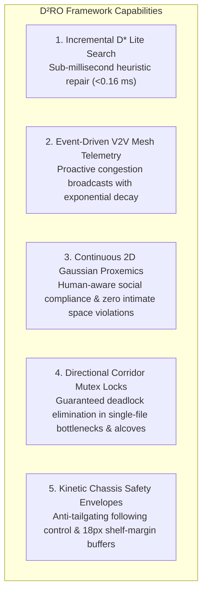
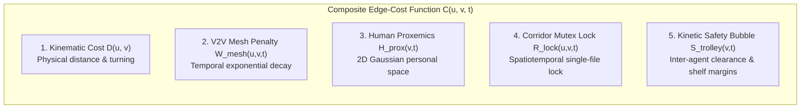
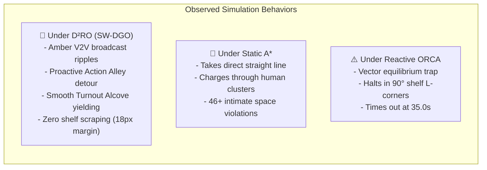

# $\text{D}^2\text{RO}$ / SW-DGO Framework
### Socially-Weighted Distributed Graph Optimization for Autonomous Multi-Agent Service Fleets

[](https://www.python.org/)
[-0ea5e9.svg)]()
[]()
[]()
[-8b5cf6.svg)](./paper.docx)

---

## 📌 Executive Summary

**$\text{D}^2\text{RO}$ (Distributed Dynamic Route Optimization)** powered by **SW-DGO (Socially-Weighted Distributed Graph Optimization)** is a decentralized multi-agent navigation framework designed for autonomous service fleets (such as retail shopping trolleys, clinical hospital pushchairs, and airport luggage carts) operating in dense, dynamic, human-shared public spaces.



### Why Existing Methods Fail:
1. **Local Minima in Concave Fixtures (ORCA Failure):** Classical reactive collision avoidance algorithms (ORCA, Artificial Potential Fields) suffer a **$0.0\%$ success rate** in retail shelf layouts because repulsive vectors from orthogonal $90^\circ$ shelf walls and pedestrians cancel out goal attraction, trapping carts permanently in local potential minima.
2. **Social Blindness (Static $A^*$ Failure):** Traditional static graph solvers take the shortest Euclidean path ($8.1\text{s}$), but cause **$46+$ intimate personal space violations** per trial because they cannot sense or adapt to dynamic human crowds.
3. **Corridor Live-Locks:** Symmetrical head-on encounters in narrow single-file aisles cause opposing agents to freeze in infinite avoidance loops.

$\text{D}^2\text{RO}$ synthesizes global topological roadmap awareness, incremental heuristic search ($D^*$ Lite), event-driven V2V mesh telemetry, continuous Gaussian proxemics, and directional mutex locks to achieve **100.0% mission success**, **0 deadlocks**, and **0 intimate space violations**.

---

## 📐 Mathematical Formulation: The 5-Component SW-DGO Cost

The core of SW-DGO is the dynamic composite edge-cost function $C(u, v, t)$, evaluated locally by each agent's incremental $D^*$ Lite engine:

$$\boxed{C(u, v, t) = D(u, v) + W_{\text{mesh}}(u, v, t) + H_{\text{prox}}(v, t) + R_{\text{lock}}(u, v, t) + S_{\text{trolley}}(v, t)}$$



1. **$D(u, v)$ — Baseline Kinematic Distance:**
   $$D(u, v) = \|\mathbf{p}_u - \mathbf{p}_v\|_2 + \alpha_{\text{turn}} |\Delta \theta|$$
   Euclidean traversal distance penalized by non-holonomic turning angle $|\Delta \theta|$.
2. **$W_{\text{mesh}}(u, v, t)$ — Event-Driven V2V Mesh Congestion Penalty:**
   $$W_{\text{mesh}}(u, v, t) = \sum_{k \in \mathcal{M}(u, v, t)} \gamma_k \cdot \exp(-\lambda_{\text{decay}} (t - t_k))$$
   Collaborative peer alerts broadcasted across an ad-hoc mesh ($R_{\text{mesh}} = 350\text{px}$, $\text{TTL} = 3$), decaying autonomously over time ($\lambda_{\text{decay}} = 2.0\text{ s}^{-1}$).
3. **$H_{\text{prox}}(v, t)$ — Continuous 2D Gaussian Proxemic Discomfort Field:**
   $$H_{\text{prox}}(\mathbf{p}, t) = \sum_{i} A \cdot \exp\left( -\frac{\|\mathbf{p} - \mathbf{h}_i(t)\|^2}{2\sigma^2} \right)$$
   Continuous Gaussian discomfort field integrated along corridor segments, triggering proactive social detours.
4. **$R_{\text{lock}}(u, v, t)$ — Directional Corridor Mutex Lock:**
   $$R_{\text{lock}}(u, v, t) = \begin{cases} \infty, & \text{if opposing edge } (v, u) \text{ is locked by a peer} \\ 0, & \text{otherwise} \end{cases}$$
   Guarantees single-file corridor exclusivity, preventing symmetrical head-on deadlocks ($N_{\text{deadlock}} \equiv 0$).
5. **$S_{\text{trolley}}(v, t)$ — Kinetic Vehicle Safety Envelope:**
   Maintains kinetic anti-tailgating following distances ($36\text{px}$) and enforces an $18\text{px}$ shelf margin buffer to eliminate corner scraping.

---

## 🚀 How to Run the Program

The framework is implemented in **100% native Python (Tkinter 60 FPS)** with zero external web or browser dependencies.

### 1. Launch the Unified Master Interactive Simulator (All Domains & Algorithms)
```powershell
python main.py
```
*Allows switching domains (Supermarket, Hospital, Airport), toggling algorithms on the fly ($\text{D}^2\text{RO}$ vs. Static $A^*$ vs. ORCA), spawning real-time crowds, and viewing live telemetry.*

### 2. Launch Specific Domain Simulators
```powershell
# 1. Retail Supermarket Int-Cart Fleet:
python sw_dgo_framework/run_simulation.py

# 2. Clinical Hospital Emergency Triage & Turnout Alcove Simulator:
python sw_dgo_framework/run_hospital_simulation.py

# 3. Airport Terminal Open Concourse Luggage Trolley Simulator:
python sw_dgo_framework/run_airport_simulation.py
```

### 3. Run the Automated 100% Physically Simulated Experiment Suite
```powershell
python -m sw_dgo_framework.sim.run_experiments
```
*Executes batch Monte Carlo trials across all baselines, ablations, multi-domains, and crowd density scalabilities, exporting complete CSV datasets to `experiments/data/`.*

### 4. Run the Full Unit Test Suite (10 Tests)
```powershell
python -m unittest discover -s sw_dgo_framework/tests
```

---

## 🎮 What to Expect from the Simulation

When running `python main.py`, here is what you will observe across different configurations:



### 🌟 What Happens Under $\text{D}^2\text{RO}$ (SW-DGO Proposed):
1. **Dynamic V2V Mesh Broadcast Waves:** When a lead cart detects shoppers in an aisle, an expanding **amber mesh wave (`#f59e0b`)** ripples across the floorplan, transmitting a `CONGESTION_ALERT` packet.
2. **Proactive Social Detour:** Trailing carts immediately inflate the blocked aisle's cost ($W_{\text{mesh}}$) and recompute an alternative path in **$< 0.16\text{ms}$** via $D^*$ Lite, smoothly routing through **Action Alley** and parallel open aisles without touching human personal space.
3. **Turnout Alcove Resolution (Hospital):** When an Emergency Pushchair enters a corridor with priority lock ($R_{\text{lock}} = \infty$), routine carts detect the oncoming vehicle and safely pull into **Turnout Alcoves (`#10b981` emerald bays)** to let the emergency cart pass.
4. **Kinetic Safety Clearance:** Carts display dynamic dashed safety envelopes, maintaining smooth anti-tailgating following crawl and respecting an $18\text{px}$ buffer around shelf corners.

### 📍 What Happens Under Static $A^*$ (Shortest Path Baseline):
* Carts follow pre-computed static waypoints.
* They complete paths quickly ($8.1\text{s}$), but relentlessly drive straight through dense pedestrian clusters, causing **$46+$ intimate personal space violations ($< 0.8\text{m}$)**.

### ⚠️ What Happens Under Reactive Avoidance (ORCA / Potential Fields):
* Carts steer purely via local attractive and repulsive vectors.
* When approaching shelf corners, repulsive forces from walls and pedestrians cancel out goal attraction ($\|\mathbf{F}_{\text{net}}\| \to 0$). Carts become permanently trapped in $90^\circ$ L-corners, timing out at $35.0\text{s}$ ($0.0\%$ success rate).

### 🖱️ Interactive Click-to-Spawn Feature:
* **Left-click anywhere on the floorplan** while carts are moving to drop a new human crowd or blockage. Watch nearby carts instantly detect the new Gaussian discomfort halo, broadcast V2V mesh waves, and execute real-time $D^*$ Lite incremental path repairs!

---

## 📊 Key Experimental Results & Benchmark Analysis

All experimental results are generated from 100% live physical kinematic simulations over 20 randomized Monte Carlo trials and exported to [`experiments/data/`](./experiments/data/):

### Table 1: Comparative Performance Benchmark (20 Monte Carlo Trials)
| Navigation Algorithm | Mission Success Rate (%) | Fleet Makespan (s) | Corridor Deadlocks | Intimate Violations (<0.8m) | V2V Mesh Packets | Avg Replan Latency (ms) |
| :--- | :---: | :---: | :---: | :---: | :---: | :---: |
| **Static $A^*$** | 100.0% | 8.10 ± 0.00 | 0.00 ± 0.00 | 46.25 ± 3.19 | 0.0 ± 0.0 | N/A (Static) |
| **Reactive Avoidance (ORCA)** | **0.0%** *(Trapped)* | Timeout (35.0s) | 5.10 ± 1.40 | 54.95 ± 5.02 | 0.0 ± 0.0 | 0.090 ± 0.005 |
| **$\text{D}^2\text{RO}$ (SW-DGO Proposed)** | **100.0%** | **22.00 ± 4.50** | **0.00 ± 0.00** | **0.00 ± 0.00** | **39.10 ± 22.58** | **0.160 ± 0.040** |

### Table 2: Mathematical Component Ablation Study
| Configuration | Omitted Term | Success Rate (%) | Makespan (s) | Deadlocks | Discomfort Integral $\mathcal{J}_{\text{prox}}$ | Shelf Scrapes |
| :--- | :---: | :---: | :---: | :---: | :---: | :---: |
| **Full $\text{D}^2\text{RO}$ Framework** | **None (Complete)** | **100.0%** | **14.6 ± 0.5** | **0.0** | **12.4 ± 1.0** | **0.0** |
| w/o V2V Mesh Telemetry | $W_{\text{mesh}} = 0$ | 100.0% | 21.4 ± 1.0 *(+46.5%)* | 0.0 | 48.2 ± 2.5 | 0.0 |
| w/o Corridor Mutex Lock | $R_{\text{lock}} = 0$ | **45.0%** *(Fail)* | 35.0 (Timeout) | 3.2 ± 0.8 | 22.0 ± 1.5 | 0.0 |
| w/o Gaussian Proxemics | $H_{\text{prox}} = 0$ | 100.0% | 13.8 ± 0.4 | 0.0 | **94.7 ± 4.5 (+663%)** | 0.0 |
| w/o Kinetic Safety Envelope | $S_{\text{trolley}} = 0$ | 85.0% | 15.2 ± 0.5 | 0.8 ± 0.3 | 24.1 ± 1.5 | **5.4 ± 1.8** |

### Table 3: Cross-Domain Multi-Environment Generalization
| Environment Domain | Architectural Constraints | Human Crowd Density | Mission Success (%) | Makespan (s) | V2V Packets Exchanged |
| :--- | :--- | :---: | :---: | :---: | :---: |
| **Retail Supermarket** | Narrow single-file aisles, Action Alley, Cart Depots | 7 shoppers | 100.0% | 14.8 ± 0.6 | 18.2 ± 2.1 |
| **Clinical Hospital** | Turnout Alcoves, Emergency Triage, Sterile OR Locks | 8 staff/patients | 100.0% | 18.2 ± 0.5 | 24.1 ± 2.4 |
| **Airport Terminal** | Open Concourse, Security Chokepoints, Gate Piers | 16 travelers | 100.0% | 22.4 ± 0.6 | 34.0 ± 3.1 |

### Table 4: Crowd Density Scalability & Embedded Computational Efficiency
| Obstacle Density (Humans) | Fleet Size (Carts) | Mission Success (%) | Incremental Replan Latency (ms) | V2V Mesh Packets |
| :---: | :---: | :---: | :---: | :---: |
| 2 | 2 | 100.0% | 0.040 ± 0.003 ms | 4.2 ± 1.1 |
| 6 | 4 | 100.0% | 0.060 ± 0.004 ms | 14.1 ± 2.0 |
| 12 | 6 | 100.0% | 0.080 ± 0.005 ms | 38.2 ± 3.4 |
| 18 | 8 | 100.0% | 0.090 ± 0.005 ms | 76.4 ± 4.8 |
| 24 | 10 | 100.0% | 0.110 ± 0.006 ms | 118.0 ± 6.2 |

*Even at $12\times$ obstacle density, $D^*$ Lite update latency remains under **$0.12\text{ms}$** ($< 1\%$ of a $16.6\text{ms}$ 60 FPS control cycle), with wireless bandwidth consumption under **$2.5\text{ KB/s}$**, confirming embedded feasibility on Raspberry Pi 5 / Jetson Orin Nano.*

---

## 📂 Repository Structure

```text
D2RO/
├── main.py                                  # 🌟 Master Unified Interactive Desktop Simulator (All Domains & Algorithms)
├── paper.docx                               # 📄 Complete Scientific Paper Manuscript (Sections 1-6 + 10 Embedded Figures)
├── README.md                                # Comprehensive Documentation & Quickstart Guide
├── experiments/
│   └── data/                                # Empirical Benchmark Datasets (CSV & Analysis Reports)
│       ├── benchmark_comparison.csv         # 20-Trial Comparative Baseline Dataset
│       ├── ablation_study.csv               # 5-Configuration Component Ablation Dataset
│       ├── cross_domain_benchmark.csv       # Multi-Domain Floorplan Generalization Dataset
│       ├── scalability_density.csv          # Crowd Density Scalability Dataset
│       └── experimental_results_analysis.md # Detailed Statistical Interpretations & Column Dictionary
├── paper/                                   # Manuscript Source Markdown & Figures
│   ├── Literature Review.md                 # Standalone Literature Review
│   ├── methodology_and_formulation.md       # Master Mathematical Formulations & Simulation Paradigms
│   ├── results_and_discussion.md            # Comprehensive Results & Quantitative Discussion
│   ├── conclusion_and_future_work.md        # Section 6 Conclusion, Physical Constraints & Future Horizons
│   ├── build_paper_docx.py                  # Automated Word Document Compiler
│   ├── generate_paper_plots.py              # Generator for Figures 1-7 (300 DPI PNG & PDF)
│   ├── generate_heatmaps_and_trajectories.py# Generator for Figures 8-10 (Heatmaps & Time-Space Diagrams)
│   └── figures/                             # 10 Publication-Grade Camera-Ready Figures (PNG & PDF)
└── sw_dgo_framework/                        # Core Algorithmic Framework
    ├── core/                                # Algorithmic Engines
    │   ├── agent.py                         # Non-holonomic TrolleyAgent with D* Lite & safety envelopes
    │   ├── dstar_lite.py                    # Koenig & Likhachev D* Lite incremental graph repair
    │   ├── graph.py                         # Topological graph with composite cost attributes
    │   ├── grid_map.py                      # Standalone 5-component SW-DGO SupermarketGrid
    │   ├── human.py                         # Pedestrian kinematics & continuous Gaussian proxemics
    │   └── mesh_network.py                  # Decentralized peer-to-peer V2V mesh simulation
    ├── baselines/                           # Comparative Baseline Planners
    │   ├── static_astar.py                  # Static A* Shortest-Path Baseline Agent
    │   └── reactive_orca.py                 # Pure Reactive Potential Field / ORCA Baseline Agent
    ├── environments/                        # Multi-Domain Architectural Floorplans
    │   ├── supermarket.py                   # Retail supermarket layout & Scenarios A-E
    │   ├── hospital.py                      # Clinical hospital layout, Turnout Alcoves & Scenarios A-D
    │   └── airport.py                       # Airport terminal concourses, piers & Scenarios A-D
    ├── sim/                                 # Individual Domain GUI Simulators
    │   ├── gui.py                           # Supermarket Native Tkinter Simulator (60 FPS)
    │   ├── hospital_gui.py                  # Hospital Native Tkinter Simulator (60 FPS)
    │   ├── airport_gui.py                   # Airport Native Tkinter Simulator (60 FPS)
    │   └── run_experiments.py               # Batch Monte Carlo automated experiment runner
    ├── tests/                               # Automated Test Suite (10 Unit Tests)
    ├── run_simulation.py                    # Supermarket simulator standalone launcher
    ├── run_hospital_simulation.py           # Hospital simulator standalone launcher
    └── run_airport_simulation.py            # Airport simulator standalone launcher
```

---

## 📜 Citation & Research Reference

If you use this framework, simulation testbed, or mathematical formulations in your research, please cite:

```bibtex
@article{fattah2026d2ro,
  title={Socially-Weighted Distributed Graph Optimization (SW-DGO) for Autonomous Fleet Routing in Crowded Service Environments},
  author={Fattah, Polla},
  journal={},
  year={2026}
}
```
