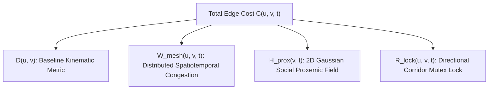

# Option 2: Formal Mathematical Specification
## Socially-Weighted Distributed Graph Optimization (SW-DGO / $\text{D}^2\text{RO}$)

This document provides the rigorous mathematical formalization of the $\text{D}^2\text{RO}$ framework, including the continuous workspace model, topological graph embedding, state-space representations, SW-DGO composite cost function components, 2D anisotropic Gaussian human proxemic fields, V2V mesh spatiotemporal decay, corridor mutex locks, and incremental heuristic key dynamics.

---

## 1. Mathematical Notation & Workspace Modeling

| Symbol | Definition |
| :--- | :--- |
| $\mathcal{W} \subset \mathbb{R}^2$ | Continuous 2D planar supermarket workspace |
| $G = (V, E)$ | Embedded topological roadmap / graph of the retail space |
| $\mathbf{p}_v = [x_v, y_v]^T \in \mathbb{R}^2$ | Physical 2D coordinates of waypoint vertex $v \in V$ |
| $e = (u, v) \in E$ | Directed corridor segment from node $u$ to node $v$ |
| $\mathcal{A} = \{a_1, a_2, \dots, a_N\}$ | Set of $N$ autonomous mobile shopping trolleys |
| $\mathcal{H}(t) = \{h_1, h_2, \dots, h_M\}$ | Set of $M$ dynamic human shoppers present at time $t$ |
| $\mathbf{x}_i(t) \in \mathcal{X}$ | Kinematic state vector of trolley $a_i$ at time $t$ |
| $\mathbf{h}_j(t) \in \mathcal{H}$ | Dynamic state vector of human pedestrian $h_j$ at time $t$ |

---

## 2. State-Space Formulations

### 2.1 Trolley Kinematics State
For each trolley $a_i \in \mathcal{A}$, the state vector $\mathbf{x}_i(t) \in \mathbb{R}^4$ is modeled under non-holonomic unicycle / differential-drive kinematics:

$$\mathbf{x}_i(t) = \begin{bmatrix} x_i(t) \\ y_i(t) \\ \theta_i(t) \\ v_i(t) \end{bmatrix}, \quad \dot{\mathbf{x}}_i(t) = \begin{bmatrix} v_i(t) \cos \theta_i(t) \\ v_i(t) \sin \theta_i(t) \\ \omega_i(t) \\ a_i(t) \end{bmatrix}$$

where:
* $\mathbf{p}_i(t) = [x_i(t), y_i(t)]^T$ is the Cartesian position,
* $\theta_i(t) \in [-\pi, \pi)$ is the orientation heading,
* $v_i(t) \in [0, v_{\max}]$ is the linear forward velocity,
* $\omega_i(t) \in [-\omega_{\max}, \omega_{\max}]$ is the angular steering velocity,
* $a_i(t) \in [-a_{\max}, a_{\max}]$ is the linear acceleration control input.

### 2.2 Human Pedestrian State
For each human shopper $h_j \in \mathcal{H}(t)$:

$$\mathbf{h}_j(t) = \begin{bmatrix} x_j^h(t) \\ y_j^h(t) \\ v_j^h(t) \\ \phi_j^h(t) \end{bmatrix}$$

where $\mathbf{p}_j^h(t) = [x_j^h(t), y_j^h(t)]^T$ is the human's position and $\mathbf{v}_j^h(t) = v_j^h [\cos \phi_j^h, \sin \phi_j^h]^T$ is their instantaneous velocity vector.

---

## 3. The SW-DGO Composite Cost Function

The dynamic edge cost $C(u, v, t)$ for traversing directed edge $(u, v) \in E$ at time $t$ is formulated as the linear combination of four decoupled objective penalties:

$$\boxed{C(u, v, t) = D(u, v) + W_{\text{mesh}}(u, v, t) + H_{\text{prox}}(v, t) + R_{\text{lock}}(u, v, t)}$$

---

## 4. Mathematical Definition of Cost Components

### 4.1 Baseline Kinematic Metric $D(u, v)$
Represents the unobstructed nominal traversal cost including Euclidean distance and turning orientation penalties:

$$D(u, v) = \|\mathbf{p}_u - \mathbf{p}_v\|_2 + \alpha_{\text{turn}} \cdot \Delta \theta(u, v)$$

where:
* $\|\mathbf{p}_u - \mathbf{p}_v\|_2 = \sqrt{(x_u - x_v)^2 + (y_u - y_v)^2}$ is the Euclidean distance,
* $\Delta \theta(u, v) = |\text{atan2}(y_v - y_u, x_v - x_u) - \theta_i|$ is the angular deviation between current heading and edge orientation,
* $\alpha_{\text{turn}} \ge 0$ is a scalar penalty weighting rotational deceleration.

---

### 4.2 Distributed V2V Mesh Congestion Penalty $W_{\text{mesh}}(u, v, t)$

When trolley $a_k$ detects a local blockage, fallen merchandise, or crowd stall on edge $(u, v)$ at time $t_0$, it broadcasts an alert with initial penalty amplitude $\Gamma_{\text{block}}$.

#### 4.2.1 Temporal Exponential Decay Model
Because retail blockages are dynamic and temporary, the mesh penalty decays continuously over time:

$$W_{\text{mesh}}(u, v, t) = \max \left( 0, \; W_{\text{mesh}}(u, v, t_0) \cdot \exp\left( -\lambda_{\text{decay}} (t - t_0) \right) \right)$$

where $\lambda_{\text{decay}} > 0$ is the temporal decay coefficient.

#### 4.2.2 Multi-Hop Spatial Confidence Attenuation
For packets received via $h$-hop relay over the ad-hoc mesh network ($h \in \{0, 1, \dots, \text{TTL}\}$):

$$W_{\text{mesh}}^{(h)}(u, v, t) = \gamma^h \cdot W_{\text{mesh}}^{(0)}(u, v, t)$$

where $\gamma \in (0, 1]$ is the spatial discount factor per relay hop.

---

### 4.3 Human-Aware Gaussian Proxemic Field $H_{\text{prox}}(v, t)$

Based on Hall’s Proxemic Theory and HA-VLN 2.0 social compliance standards, humans possess an asymmetric personal space bubble. Navigating inside this zone causes discomfort.

#### 4.3.1 2D Anisotropic Gaussian Formulation
For a human shopper $h_j$ located at $\mathbf{p}_j^h = [x_j^h, y_j^h]^T$ moving with heading $\phi_j^h$, the continuous social cost field at any point $\mathbf{p} = [x, y]^T$ is:

$$H_j(\mathbf{p}, t) = A_j \cdot \exp \left( -\frac{1}{2} (\mathbf{p} - \mathbf{p}_j^h)^T \mathbf{R}(\phi_j^h) \mathbf{\Sigma}_j^{-1} \mathbf{R}(\phi_j^h)^T (\mathbf{p} - \mathbf{p}_j^h) \right)$$

where:
* $A_j > 0$ is the peak discomfort amplitude.
* $\mathbf{R}(\phi_j^h)$ is the 2D rotation matrix aligning the field with human heading:
  $$\mathbf{R}(\phi_j^h) = \begin{bmatrix} \cos \phi_j^h & -\sin \phi_j^h \\ \sin \phi_j^h & \cos \phi_j^h \end{bmatrix}$$
* $\mathbf{\Sigma}_j$ is the diagonal anisotropic covariance matrix modeling asymmetric personal space:
  $$\mathbf{\Sigma}_j = \begin{bmatrix} \sigma_{\text{front}}^2 & 0 \\ 0 & \sigma_{\text{side}}^2 \end{bmatrix}, \quad \text{with } \sigma_{\text{front}} \ge \sigma_{\text{side}} = \sigma_{\text{rear}}$$

#### 4.3.2 Aggregate Waypoint Proxemic Penalty
The proxemic cost assigned to vertex $v \in V$ at time $t$ across all active shoppers $\mathcal{H}(t)$ is:

$$H_{\text{prox}}(v, t) = \sum_{j=1}^{M(t)} H_j(\mathbf{p}_v, t)$$

#### 4.3.3 Continuous Edge Integral (Segment Cost)
For edge $(u, v)$ parameterized by $\mathbf{p}(\tau) = (1 - \tau)\mathbf{p}_u + \tau \mathbf{p}_v$ for $\tau \in [0, 1]$:

$$H_{\text{prox}}^{\text{edge}}(u, v, t) = \int_0^1 \sum_{j=1}^{M(t)} H_j(\mathbf{p}(\tau), t) \, d\tau$$

---

### 4.4 Spatiotemporal Directional Corridor Lock $R_{\text{lock}}(u, v, t)$

In supermarket layouts, vertical aisles between shelf racks are narrow single-file corridors where width $w_{\text{aisle}} < 2 r_{\text{trolley}}$, making bidirectional passing kinematically impossible.

#### 4.4.1 Mutex Reservation Condition
Let $\mathcal{L}_i(u, v, t) \in \{0, 1\}$ denote whether trolley $a_i$ holds an active lock on edge $(u, v)$ at time $t$. 

The directional penalty $R_{\text{lock}}(u, v, t)$ evaluated by trolley $a_i$ is:

$$R_{\text{lock}}(u, v, t) = \begin{cases} \infty & \text{if } \exists k \neq i \text{ such that } \mathcal{L}_k(v, u, t) = 1 \text{ and } t < t_{\text{expiry}} \\ 0 & \text{otherwise} \end{cases}$$

#### 4.4.2 Mathematical Invariant (Deadlock Prevention)
$$\forall (u, v) \in E_{\text{single-file}}, \quad \sum_{k=1}^N \left( \mathcal{L}_k(u, v, t) + \mathcal{L}_k(v, u, t) \right) \le 1, \quad \forall t \ge 0$$

This strict mutual exclusion condition guarantees that opposing trolleys can never enter the same single-file corridor simultaneously, completely eliminating head-on live-locks.

---

## 5. Incremental Search & $D^*$ Lite Key Dynamics

### 5.1 Value Functions
Each trolley $a_i$ maintains two estimates for every vertex $s \in V$:
* $g(s)$: The current estimate of the shortest path distance from $s$ to goal $s_{\text{goal}}$.
* $rhs(s)$: The one-step lookahead cost based on successor $g$-values:

$$rhs(s) = \begin{cases} 0 & \text{if } s = s_{\text{goal}} \\ \min_{s' \in \text{Succ}(s)} \left( C(s, s', t) + g(s') \right) & \text{otherwise} \end{cases}$$

A vertex $s$ is **consistent** if $g(s) = rhs(s)$, and **inconsistent** if $g(s) \neq rhs(s)$.

### 5.2 Dynamic Key Calculation
Inconsistent vertices are stored in a priority queue $U$ ordered lexicographically by dynamic key vector $\mathbf{k}(s) = [k_1(s), k_2(s)]^T$:

$$\begin{aligned}
k_1(s) &= \min\left(g(s), rhs(s)\right) + h(s_{\text{start}}, s) + k_m \\
k_2(s) &= \min\left(g(s), rhs(s)\right)
\end{aligned}$$

where:
* $h(s_{\text{start}}, s) = \|\mathbf{p}_{s_{\text{start}}} - \mathbf{p}_s\|_2$ is the Euclidean distance heuristic.
* $k_m = \sum_{l=1}^K h(s_{\text{last}}^{(l-1)}, s_{\text{last}}^{(l)})$ is the scalar key accumulator updated whenever the trolley advances to a new waypoint $s_{\text{start}}$, preserving the validity of keys in $U$ without requiring a full queue re-heapification ($O(|U|)$).

---

## 6. Mathematical Summary for Paper Section

$$\min_{\pi \in \Pi(s_{\text{start}}, s_{\text{goal}})} \sum_{k=0}^{|\pi|-1} \left[ D(v_k, v_{k+1}) + W_{\text{mesh}}(v_k, v_{k+1}, t_k) + H_{\text{prox}}(v_{k+1}, t_k) + R_{\text{lock}}(v_k, v_{k+1}, t_k) \right]$$

Subject to:
1. **Dynamic Kinematics:** $\dot{\mathbf{x}}_i(t) = f(\mathbf{x}_i(t), \mathbf{u}_i(t)), \quad \|\mathbf{u}_i(t)\| \le u_{\max}$
2. **Corridor Mutex Invariant:** $\mathcal{L}_i(u, v, t) + \mathcal{L}_j(v, u, t) \le 1, \quad \forall i \neq j, \; (u, v) \in E_{\text{single-file}}$
3. **Decay Convergence:** $\lim_{t \to \infty} W_{\text{mesh}}(u, v, t) = 0$
