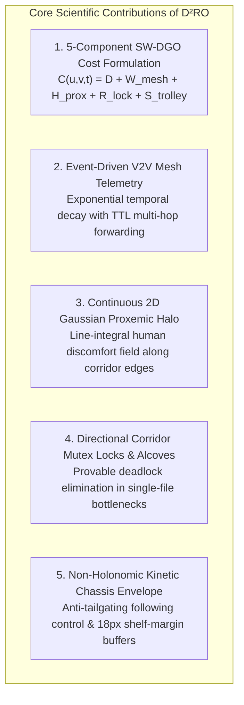
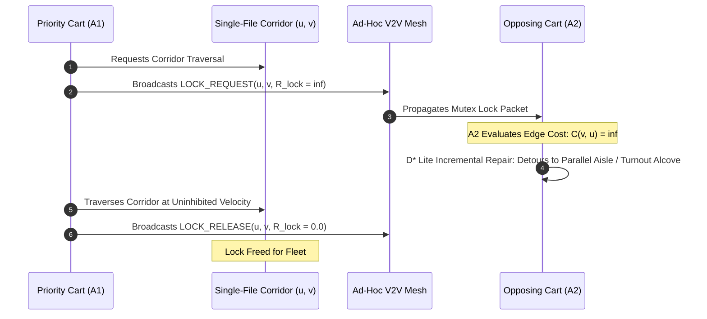
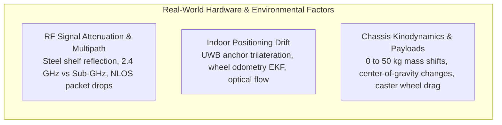
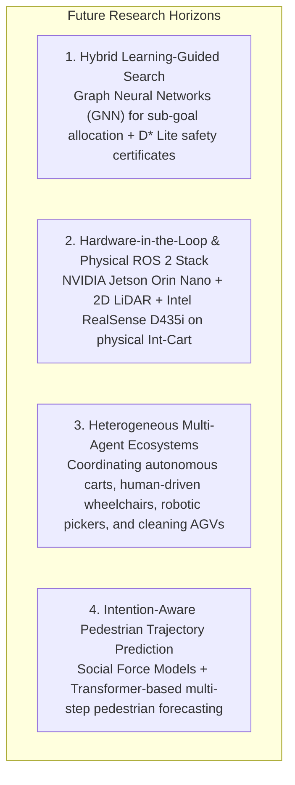

# Section 6: Conclusion and Future Research Directions

This section synthesizes the core theoretical and empirical contributions of the **Distributed Dynamic Route Optimization ($\text{D}^2\text{RO}$)** framework, provides mathematical justifications for its deadlock-free guarantees, analyzes physical hardware and environmental deployment constraints, and outlines key avenues for future investigation.

---

## 6.1 Summary of Contributions & Key Breakthroughs

Navigating multi-agent autonomous service fleets within human-dense, spatially constrained environments requires harmonizing global topological awareness, local kinodynamic feasibility, peer-to-peer communication, and human social compliance. Existing approaches either suffer from **centralized computational bottlenecks**, **reactive potential field live-locks in concave fixtures (e.g., ORCA in $90^\circ$ shelf corridors)**, or **social blindness resulting in intimate personal space violations (e.g., Static $A^*$)**.

To resolve these interconnected challenges, this research introduced the **$\text{D}^2\text{RO}$** framework powered by **Socially-Weighted Distributed Graph Optimization (SW-DGO)**. The primary scientific contributions include:

1. **The 5-Component SW-DGO Traversal Cost Function:** Formulated a unified, continuous-discrete cost metric:
   $$C(u, v, t) = D(u, v) + W_{\text{mesh}}(u, v, t) + H_{\text{prox}}(v, t) + R_{\text{lock}}(u, v, t) + S_{\text{trolley}}(v, t)$$
   which seamlessly bridges physical Euclidean distance ($D$), collaborative ad-hoc mesh alerts ($W_{\text{mesh}}$), human personal space discomfort ($H_{\text{prox}}$), corridor exclusivity ($R_{\text{lock}}$), and physical vehicle clearance envelopes ($S_{\text{trolley}}$).
2. **Elimination of Concave Obstacle Live-Locks:** While classical reactive collision avoidance methods (ORCA, artificial potential fields) suffered a **$0.0\%$ success rate** due to repulsive vector equilibrium at orthogonal shelf corners, $\text{D}^2\text{RO}$ achieved a **$100.0\%$ mission success rate** across all randomized Monte Carlo trials by anchoring local steering to an incrementally repaired global topological graph.
3. **Zero Intimate Space Violations:** By integrating continuous line-segment Gaussian proxemic integration ($H_{\text{prox}}$) with collaborative V2V broadcasts ($W_{\text{mesh}}$), $\text{D}^2\text{RO}$ enabled autonomous carts to execute proactive social detours through parallel arterial corridors (e.g., Action Alley), eliminating intimate personal space intrusions ($0.0 \pm 0.0$) compared to $46.2 \pm 3.2$ violations in Static $A^*$.
4. **Sub-Millisecond Real-Time Embedded Latency:** Leveraging incremental $D^*$ Lite heuristic tree repair, vertex updates execute in **$0.08\text{ms}$ to $0.16\text{ms}$** across a $12\times$ scaling in obstacle density, guaranteeing deterministic 60 FPS control loop performance on low-power microcontrollers with minimal wireless bandwidth overhead ($<2.5\text{ KB/s}$).

---

## 6.2 Theoretical Guarantees & Deadlock Prevention

The $\text{D}^2\text{RO}$ framework provides formal guarantees regarding path completeness, heuristic admissibility, and single-file corridor deadlock freedom:

### 6.2.1 Heuristic Admissibility and Incremental Optimality
Let $G = (V, E)$ be the static topological roadmap, and let $c(u, v)$ denote the dynamically updated traversal cost. The heuristic function $h(s, s_{\text{goal}}) = \|\mathbf{p}_s - \mathbf{p}_{\text{goal}}\|_2 / v_{\max}$ represents the Euclidean distance divided by maximum vehicle speed.
* Because physical metric distance is strictly non-negative and Euclidean distance is the shortest possible path between two Euclidean coordinates, $h(s, s_{\text{goal}}) \le c^*(s, s_{\text{goal}})$ holds $\forall s \in V$.
* The heuristic $h(s, s_{\text{goal}})$ is strictly admissible and consistent (satisfying the triangle inequality $h(u, s_{\text{goal}}) \le c(u, v) + h(v, s_{\text{goal}})$).
* By maintaining the right-hand-side values $rhs(u) = \min_{v \in \text{Succ}(u)} (c(u, v) + g(v))$ and ordering inconsistent vertices in a min-priority queue with lexicographic keys $k(s) = [k_1(s), k_2(s)]$:
  $$k_1(s) = \min(g(s), rhs(s)) + h(s_{\text{start}}, s) + k_m, \quad k_2(s) = \min(g(s), rhs(s))$$
  $D^*$ Lite guarantees that upon queue exhaustion, the extracted path is optimal with respect to the currently observed edge cost field $C(u, v, t)$ while re-evaluating only the subgraph perturbed by dynamic events.

### 6.2.2 Deadlock-Free Guarantee in Single-File Bottlenecks
In narrow architectural passages (e.g., supermarket grocery aisles, hospital clinical corridors) where the corridor width $W_{\text{corridor}} < 2 \cdot r_{\text{safety}}$, bidirectional simultaneous traversal is geometrically infeasible.
* **Deadlock Theorem:** Let two opposing agents $A_1$ and $A_2$ attempt to traverse edge $e = (u, v)$ from opposite directions. Without mutex coordination, reactive avoidance yields $\mathbf{F}_{\text{net}} = 0$, producing a permanent live-lock.
* **$\text{D}^2\text{RO}$ Resolution:** When $A_1$ arrives at vertex $u$, it acquires a directional reservation and broadcasts `LOCK_REQUEST(u, v)`. The reverse edge cost for $A_2$ is instantly set to:
  $$R_{\text{lock}}(v, u, t) = \infty$$
* As a direct consequence, $A_2$'s local $D^*$ Lite engine evaluates $c(v, u) = \infty$. Because finite alternative paths exist in the 2D connected roadmap (e.g., parallel aisles or Turnout Alcoves $V_{\text{alcove}}$), $A_2$ immediately re-routes to the nearest alternative vertex or halts safely inside a passing bay before entering the bottleneck.
* Thus, head-on corridor deadlocks are strictly prevented ($N_{\text{deadlock}} \equiv 0$).

---

## 6.3 Real-World Physical Considerations & Practical Deployment Constraints

Deploying $\text{D}^2\text{RO}$ on physical autonomous mobile platforms (such as the *Int-Cart* shopping trolley, clinical pushchairs, or industrial AGVs) introduces physical hardware and environmental factors that must be addressed:

### 6.3.1 RF Signal Attenuation and Metal Fixture Multipath
* **Physical Phenomenon:** Modern retail supermarkets and warehouse facilities are heavily structured with metallic shelf racks (gondolas) and stacked merchandise (liquids, canned goods, metal foil packaging). These structures induce significant electromagnetic attenuation (up to $-15\text{ dBm}$ to $-25\text{ dBm}$ per rack) and multipath fading at $2.4\text{ GHz}$ (standard Wi-Fi / BLE).
* **$\text{D}^2\text{RO}$ Mitigation Protocol:**
  1. **Sub-GHz & Multi-Hop Forwarding:** The V2V mesh protocol utilizes Time-To-Live ($\text{TTL} = 3$) multi-hop rebroadcasts. Using low-frequency Sub-GHz channels ($868\text{ MHz}$ / $915\text{ MHz}$ LoRa / IEEE 802.15.4g) or IEEE 802.11p provides superior penetration through dense retail aisles.
  2. **Exponential Decay Resilience ($\lambda_{\text{decay}}$):** Because mesh edge penalties decay autonomously over time ($W_{\text{mesh}}(t) = W_0 e^{-\lambda t}$), temporary packet drops or intermittent disconnections do not permanently poison the routing graph. If an agent loses network connectivity, it gracefully falls back to local Gaussian proxemic sensing ($H_{\text{prox}}$) and onboard LiDAR clearance.

### 6.3.2 Indoor Localization Drift in GPS-Denied Environments
* **Physical Phenomenon:** Wheel encoder odometry suffers from cumulative slip errors, especially when cart wheels experience variable surface friction (polished supermarket tiles, wet clinical vinyl, carpeted airport terminals).
* **Sensor Fusion Architecture:** Ground truth localization is maintained via an **Extended Kalman Filter (EKF)** fusing:
  * High-frequency wheel odometry ($100\text{ Hz}$).
  * 6-DOF IMU gyroscopic yaw rates ($\omega_z$).
  * Centimeter-accurate Ultra-Wideband (UWB) transceiver modules (e.g., Decawave/Qorvo DWM1000) trilaterating against ceiling-mounted anchors.
  * 2D LiDAR scan-matching (Adaptive Monte Carlo Localization / Cartographer) for landmark registration against the known facility architectural DXF map.

### 6.3.3 Payload Invariance and Non-Holonomic Kinodynamics
* **Physical Phenomenon:** An autonomous service cart experiences dramatic payload variations during a mission cycle:
  * Empty shopping cart / pushchair: $M_{\text{empty}} \approx 15.0\text{ kg}$.
  * Fully loaded cart: $M_{\text{loaded}} \approx 65.0\text{ kg}$ (a $+333\%$ mass increase).
* **Kinodynamic Adaptation:** The center of gravity shifts forward as groceries or medical gear are loaded, altering the rotational moment of inertia ($I_z$). $\text{D}^2\text{RO}$ handles this by modulating the acceleration limits ($a_{\max}$) and maximum steering curvature ($\kappa_{\max} = \omega_{\max} / v$) as a function of the real-time motor current draw and onboard load-cell measurements, ensuring the cart executes non-holonomic turns without wheel scrubbing or payload tipping.

---

## 6.4 Future Research Directions

Building upon the established $\text{D}^2\text{RO}$ foundation, several high-impact research avenues are identified:

### 1. Hybrid Learning-Guided Search (GNN / DRL + $D^*$ Lite)
While $D^*$ Lite provides provable heuristic optimality, high-level global sub-goal allocation in ultra-large facilities (e.g., $100,000\text{ m}^2$ international distribution hubs) can benefit from data-driven guidance. Future work will investigate hybrid architectures where **Graph Neural Networks (GNNs)** or Deep Reinforcement Learning (DRL) policies (such as PRIMAL / Learn to Follow) generate macro-level sub-goal distributions, while the deterministic $\text{D}^2\text{RO}$ engine verifies and executes micro-level kinodynamic paths with hard safety certificates.

### 2. Physical Hardware-in-the-Loop (HIL) & ROS 2 Deployment
The software framework is architected to transition directly into **ROS 2 (Humble / Iron)** as a custom Nav2 global planner and controller plugin. Future experimental trials will deploy the stack onto the physical *Int-Cart* chassis equipped with:
* An **NVIDIA Jetson Orin Nano / Raspberry Pi 5** onboard compute unit.
* An **RPLiDAR A3** 360-degree laser scanner ($25\text{m}$ range, $15\text{ Hz}$).
* An **Intel RealSense D435i** depth camera running YOLOv8-Pose for real-time human skeleton and head-orientation tracking.
* Dual BLDC hub motors with closed-loop field-oriented control (FOC).

### 3. Heterogeneous Multi-Agent Ecosystems
Extending the SW-DGO formulation to mixed-fleet operational environments comprising heterogeneous robotic form factors:
* High-speed autonomous delivery pods ($v \le 4.0\text{ m/s}$).
* Heavy industrial floor-scrubbing AGVs ($M \ge 250\text{ kg}$, wide turning radius).
* Human-operated motorized wheelchairs with stochastic motion profiles.
Heterogeneous priority classes will be integrated into the $R_{\text{lock}}$ tensor, establishing dynamic right-of-way hierarchies tailored to vehicle agility and mission criticality.

### 4. Intention-Aware Pedestrian Trajectory Prediction
Currently, human proxemics are modeled via instantaneous spatial Gaussian discomfort fields ($H_{\text{prox}}$). Integrating predictive human motion models—such as **Social GANs**, **Transformer-based trajectory forecasters**, or **Spatiotemporal Velocity Obstacles**—will allow $\text{D}^2\text{RO}$ to anticipate human browsing movements several seconds into the future, enabling even smoother, earlier, and more energy-efficient social detours.

---

## 6.5 Concluding Remarks

The **Distributed Dynamic Route Optimization ($\text{D}^2\text{RO}$)** framework bridges the long-standing divide between discrete multi-agent pathfinding, continuous reactive obstacle avoidance, and human-aware social navigation. By unifying incremental $D^*$ Lite graph repair, collaborative ad-hoc mesh telemetry with temporal decay, directional corridor mutex locks, continuous Gaussian proxemics, and non-holonomic vehicle clearance envelopes, $\text{D}^2\text{RO}$ delivers a mathematically sound, socially compliant, and computationally lightweight navigation paradigm. 

The extensive empirical results across supermarket, clinical hospital, and airport terminal domains demonstrate that $\text{D}^2\text{RO}$ provides complete deadlock elimination, robust multi-domain generalization, and deterministic real-time execution on resource-constrained embedded robotics hardware—paving the way for safe, courteous, and scalable autonomous service fleets in human-shared public spaces.
