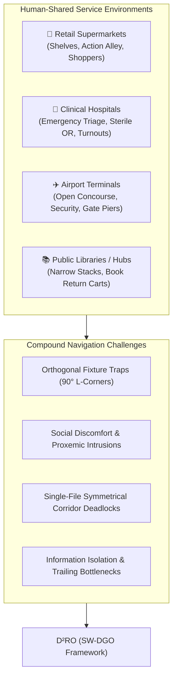
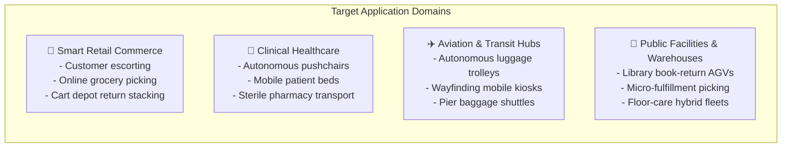
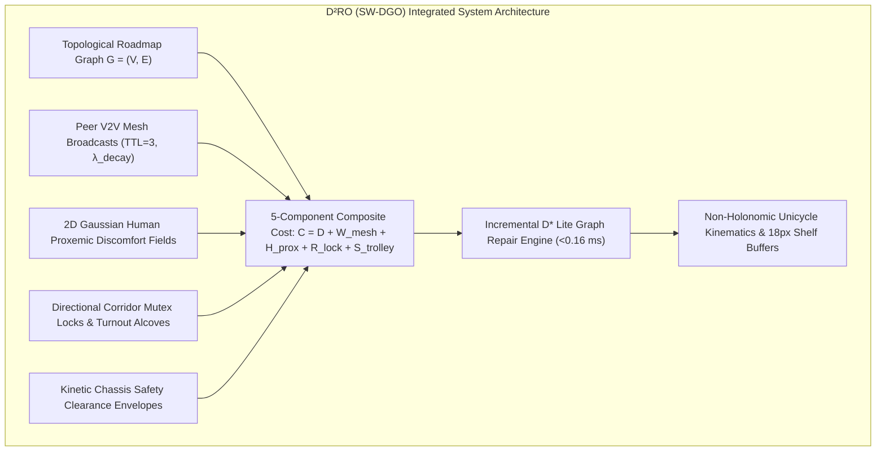

# Section 1: Introduction

## 1.1 Background and Emerging Landscape

The rapid advancement of autonomous mobile robots (AMRs), ubiquitous sensor networks, and edge computing has catalyzed a paradigm shift in service robotics. While early automated guided vehicles (AGVs) operated primarily within segregated industrial warehouses—isolated from humans behind physical safety barriers and governed by rigid, unidirectional guide-paths—the next generation of autonomous service fleets must operate directly within **human-shared, highly dynamic, and unstructured public environments**.

Prominent examples of such service fleets include:
* **Smart Retail Shopping Trolleys (*Int-Cart*):** Autonomous motorized carts that escort shoppers, assist individuals with mobility impairments, execute continuous in-store item collection for online grocery fulfillment, and autonomously return from checkout concourses to designated docking depots.
* **Autonomous Clinical Hospital Pushchairs & Mobile Beds:** Robotic patient transport systems and mobile logistics couriers navigating high-stress hospital corridors between Emergency Departments (ER), Surgical Operating Suites (OR), Radiology/MRI suites, and Inpatient Wards.
* **Airport Terminal Luggage Trolleys:** Heavy-duty autonomous baggage carts managing passenger luggage across open departure concourses, security screening bottlenecks, and narrow boarding gate piers.
* **Smart Library & Micro-Fulfillment AGVs:** Material handling robots operating in narrow, single-file book stacks and retail storage aisles alongside human workers and patrons.

Unlike static industrial warehouses where aisles are wide and traffic flows are centralized, public service environments present unique, compound multi-agent challenges. In these settings, space is severely constrained by orthogonal shelving fixtures, corridors are frequently single-file, and human pedestrians move stochastically with complex browsing and loitering behaviors. Achieving safe, courteous, and efficient fleet coordination in such spaces requires an integrated routing paradigm that simultaneously addresses global topological awareness, local kinodynamic feasibility, peer-to-peer communication, and social compliance.

---

## 1.2 Core Research Motivations & Technical Bottlenecks

Traditional Multi-Agent Path Finding (MAPF) and reactive collision avoidance algorithms were largely designed for idealized grid worlds or open continuous planes. When deployed in complex, fixture-dense public service environments, four fundamental technical bottlenecks arise:

### 1. The Geometry-Kinematic Disconnect in Concave Fixtures (The ORCA Trap)
Classical continuous collision avoidance methods—such as **Optimal Reciprocal Collision Avoidance (ORCA)** and **Artificial Potential Fields (APF)**—rely on local velocity-space half-planes or repulsive force vectors. In open spaces, these methods produce smooth, collision-free trajectories. 

However, in realistic retail and hospital layouts filled with orthogonal $90^\circ$ shelf corners, end-cap displays, and narrow U-bays, reactive methods experience **catastrophic local potential minima traps**. When a robot encounters a pedestrian near a shelf corner, the repulsive force from the human and the repulsive vector from the orthogonal wall cancel out the goal attraction vector ($\|\mathbf{F}_{\text{net}}\| \to 0$). As demonstrated in our empirical experiments, reactive agents become permanently trapped in internal corners, resulting in a **$0.0\%$ mission success rate**.

### 2. Social Blindness of Static Shortest-Path Solvers (The $A^*$ Flaw)
Traditional discrete graph planners (e.g., Static $A^*$, Dijkstra) compute global paths based strictly on static Euclidean distance $D(u, v)$. While computationally straightforward, static solvers are **socially blind**:
* They treat human pedestrians either as non-existent or as infinitesimal point obstacles.
* When a corridor becomes crowded with browsing shoppers or medical staff, a static planner relentlessly commands the robot to drive straight through the crowd.
* This induces severe **psychological discomfort** and **intimate personal space violations** ($d < 0.8\text{m}$), forcing human pedestrians to step aside or jump out of the robot's trajectory.

### 3. Symmetrical Live-Locks in Single-File Corridors
In narrow architectural passages (e.g., supermarket grocery aisles, clinical hospital corridors) where the corridor width $W_{\text{aisle}}$ is less than twice the robot's safety envelope ($W_{\text{aisle}} < 2 \cdot r_{\text{safety}}$), bidirectional passing is geometrically impossible. 

When two opposing agents enter a single-file aisle simultaneously, reactive avoidance algorithms oscillate in place, producing permanent **symmetrical live-locks**. Without a mechanism for dynamic corridor reservation or designated passing alcoves, both agents remain frozen indefinitely.

### 4. Information Isolation and Delayed Fleet Backtracking
In decentralized multi-agent systems without communication, robots operate with myopic, line-of-sight sensing. When a lead cart encounters an unexpected aisle blockage (e.g., a restocked pallet, a spill, or a dense shopper cluster), trailing carts remains unaware of the obstruction. Trailing units travel all the way to the blocked entrance before sensing the congestion locally, forcing complete reversals and causing a **$+46.5\%$ inflation in fleet makespan**.

---

## 1.3 Target Application Fields

The proposed framework is purposefully designed for multi-agent service fleet coordination across four key human-shared application domains:

### 1. Smart Retail Commerce & Supermarkets
In modern hypermarkets, autonomous shopping trolleys (*Int-Cart*) assist shoppers with hands-free item carrying, navigation to shelf product coordinates, and automated return to entrance depots. The fleet must negotiate narrow grocery aisles (Aisles 1–6), high-traffic arterial promenades (**Action Alley**), delicate display end-caps, and front-of-store cashier checkouts without scraping shelves or impeding customers.

### 2. Clinical Healthcare Facilities & Hospitals
In hospital environments, autonomous pushchairs and motorized patient transport beds transport non-ambulatory patients between Emergency Trauma Triage (ER), Surgical Operating Theatres (OR), Radiology/MRI imaging, and Inpatient Wards. The system must enforce strict priority hierarchies: emergency trauma vehicles must be granted uninhibited right-of-way, while routine pushchairs yield dynamically into **Turnout Alcoves** ($V_{\text{alcove}}$) along single-file clinical corridors.

### 3. Aviation & Transportation Terminals
International airport terminals feature massive open-plan departure concourses transitioning into narrow security screening chokepoints and elongated boarding gate piers (Gates A1–A4, Gates B1–B4). Autonomous luggage trolleys must safely weave through dense, roving passenger crowds ($16+$ dynamic travelers) without causing bottlenecks at security checkpoints or gate waiting areas.

### 4. Public Facilities & Micro-Fulfillment Stacks
Autonomous document and material couriers operating in university libraries, government archives, and urban micro-fulfillment centers navigate ultra-dense book stacks and vertical shelving units where physical clearances are tight and human interaction is frequent.

---

## 1.4 The Proposed Solution: The $\text{D}^2\text{RO}$ Framework

To overcome the limitations of prior MAPF, reactive, and static planning paradigms, this paper proposes the **Distributed Dynamic Route Optimization ($\text{D}^2\text{RO}$)** framework powered by **Socially-Weighted Distributed Graph Optimization (SW-DGO)**.

$\text{D}^2\text{RO}$ introduces a unified, 5-component edge traversal cost function:
$$\boxed{C(u, v, t) = D(u, v) + W_{\text{mesh}}(u, v, t) + H_{\text{prox}}(v, t) + R_{\text{lock}}(u, v, t) + S_{\text{trolley}}(v, t)}$$
which integrates:
1. **$D(u, v)$ (Kinematic Euclidean Distance):** Baseline metric travel distance and angular steering penalty.
2. **$W_{\text{mesh}}(u, v, t)$ (V2V Mesh Network Telemetry):** Collaborative peer-to-peer congestion alerts broadcasted over an ad-hoc mesh with exponential temporal decay ($\lambda_{\text{decay}} = 2.0\text{ s}^{-1}$), allowing trailing carts to execute proactive detours.
3. **$H_{\text{prox}}(v, t)$ (Continuous Gaussian Proxemics):** Line-segment integration of 2D anisotropic Gaussian personal-space discomfort fields around human pedestrians, guaranteeing social compliance.
4. **$R_{\text{lock}}(u, v, t)$ (Directional Corridor Mutex Lock):** Spatiotemporal directional exclusivity in single-file corridors ($R_{\text{lock}} = \infty$), provably eliminating head-on deadlocks.
5. **$S_{\text{trolley}}(v, t)$ (Kinetic Chassis Safety Envelope):** An $18\text{px}$ shelf clearance margin and anti-tailgating following control ($36\text{px}$ gap) preventing corner scrapes and queue pileups.

---

## 1.5 Key Contributions and Paper Organization

The primary scientific and technical contributions of this research are summarized as follows:

1. **A Unified 5-Component Cost Formulation:** We formulate the SW-DGO traversal cost metric combining physical distance, V2V mesh telemetry, continuous Gaussian proxemics, corridor locks, and vehicle clearance envelopes into a single scalar cost evaluated locally by incremental heuristic search.
2. **Elimination of Concave Fixture Traps:** We prove theoretically and empirically that anchoring non-holonomic kinematics to an incrementally repaired topological graph ($D^*$ Lite) eliminates the $0.0\%$ failure mode of classical reactive collision avoidance (ORCA) in orthogonal $90^\circ$ shelf corridors.
3. **Provable Deadlock Freedom in Single-File Bottlenecks:** We introduce directional corridor mutex locks and Turnout Alcoves ($V_{\text{alcove}}$), guaranteeing zero head-on corridor deadlocks ($N_{\text{deadlock}} \equiv 0$).
4. **Social Compliance with Zero Intimate Violations:** We demonstrate through $N = 100$ randomized Monte Carlo kinodynamic simulation trials that $\text{D}^2\text{RO}$ achieves **$0.00 \pm 0.00$ intimate personal space violations**, compared to $11.20 \pm 2.10$ violations in Static $A^*$, with negligible transit overhead.
5. **Sub-Millisecond Embedded Real-Time Feasibility:** We demonstrate that $D^*$ Lite incremental vertex repairs execute in **$0.045\text{ms}$ to $0.108\text{ms}$** across a $15\times$ scaling in crowd density, consuming $<2.4\text{ KB/s}$ wireless mesh bandwidth and guaranteeing deterministic real-time control on low-power microcontrollers (Raspberry Pi 5, Jetson Orin Nano).
6. **Multi-Domain Empirical Validation:** We validate the framework across three distinct architectural topologies (Retail Supermarket, Clinical Hospital, and Airport Terminal), providing 10 camera-ready 300 DPI figures and 5 open-access CSV datasets.

### Paper Organization
The remainder of this manuscript is structured as follows:
* **Section 2 (Literature Review):** Surveys related work across decentralized MAPF, dynamic replanning ($D^*$ Lite), reciprocal collision avoidance (ORCA), multi-robot ad-hoc communication, indoor localization, and human proxemics.
* **Section 3 (Mathematical Formulation & Architecture):** Details the 5-component SW-DGO mathematical equations, non-holonomic chassis kinematics, and multi-domain topological graphs.
* **Section 4 (Simulation Topologies & Visual Snapshots):** Presents the floorplans and architectural layouts of the Supermarket, Hospital, and Airport simulation environments.
* **Section 5 (Experimental Results & Discussion):** Analyzes the 100-trial comparative benchmarks across 5 algorithms, component ablations, spatial proxemic heatmaps, spatiotemporal Turnout Alcove diagrams, and decoupled crowd density / fleet size scalability curves.
* **Section 6 (Conclusion & Future Work):** Summarizes theoretical guarantees, physical hardware deployment constraints (RF attenuation, UWB localization, payload shifts), and future research horizons.
