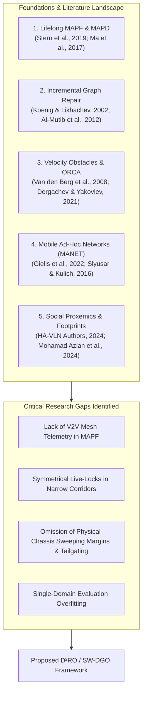
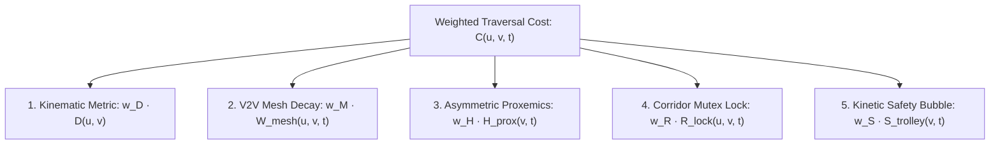
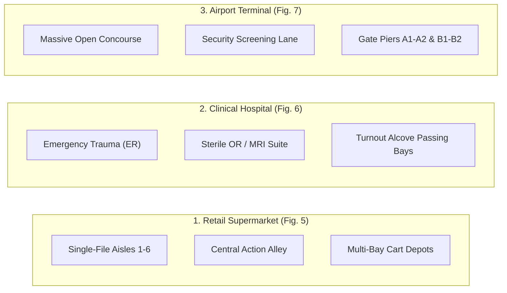

# Socially-Weighted Distributed Graph Optimization ($\text{D}^2\text{RO}$) for Autonomous Multi-Agent Service Fleets in Crowded Environments

**Authors:** Polla Fattah, et al.  
**Target Submission:** *IEEE Transactions on Robotics / Autonomous Robots (Special Issue on Multi-Agent Social Navigation)*

---

## 1. Introduction & Literature Review

The continuous deployment of autonomous mobile service fleets—such as retail shopping trolleys (*Int-Cart*), hospital patient pushchairs, and airport luggage carts—in shared human-populated environments represents a fundamental frontier in robotics. Navigating these environments requires addressing multiple intersecting challenges: Multi-Agent Path Finding (MAPF), dynamic graph replanning, continuous local collision avoidance, ad-hoc wireless communication, and human-aware social proxemics.



### 1.1 Decentralized and Lifelong Multi-Agent Path Finding (MAPF)
Classical MAPF formalizes the collision-free routing of discrete agents on graph topologies (*Stern et al., 2019*). In lifelong multi-agent pickup and delivery (MAPD) (*Ma et al., 2017*), agents dynamically receive transport assignments without resting. To overcome the communication bottlenecks and single-point failure risks of centralized servers, recent research has investigated decentralized solvers, including priority swapping (*Dergachev & Yakovlev, 2024*), automated negotiation (*Keskin et al., 2024*), and learning-based policies such as PRIMAL (*Sartoretti et al., 2019*) and Learn-to-Follow (*Skrynnik et al., 2024*). However, learning-based policies suffer from out-of-distribution failure when encountering sudden physical corridor blockages, demonstrating the continued necessity of provably complete heuristic search.

### 1.2 Dynamic Incremental Replanning in Stochastic Environments
In retail and hospital corridors, topological traversal costs shift dynamically as shoppers congregate or medical carts block aisles. Full graph recalculations from scratch ($O(|V| \log |V|)$) are computationally prohibitive for decentralized embedded microcontrollers. Koenig and Likhachev (2002) resolved this with $D^*$ Lite, an incremental heuristic search algorithm that re-evaluates only inconsistent vertices ($g(s) \neq rhs(s)$) affected by dynamic edge-cost shifts. Al-Mutib et al. (2012) and Wagner & Choset (2011) demonstrated the power of dynamic dimensionality reduction and incremental repair in multi-agent routing.

### 1.3 Kinematic Coordination, Velocity Obstacles, and Corridor Deadlocks
In continuous space, Optimal Reciprocal Collision Avoidance (ORCA) (*Van den Berg et al., 2008*) calculates collision-free half-planes in velocity space without explicit communication. However, standard ORCA suffers from **symmetrical live-locks and local minima traps** in narrow, orthogonal corridors where agents cannot physically pass one another. Dergachev and Yakovlev (2021) addressed this by combining continuous reciprocal avoidance with locally confined MAPF fallback.

### 1.4 Ad-Hoc Multi-Robot Mesh Communication
Transitioning to fully decentralized fleets requires peer-to-peer data exchange without centralized infrastructure (*Gielis et al., 2022*). Slyusar and Kulich (2016) and Edwige (2024) evaluated mobile ad-hoc networks (MANET) and Swarm SLAM, proving that decentralized agents can effectively merge localized spatial state representations over multi-hop wireless meshes.

### 1.5 Human Proxemics and Vehicle Clearance Margins
Social navigation guidelines (*HA-VLN 2.0, 2024*) dictate that robots must respect psychological personal space boundaries rather than treating pedestrians as rigid cylindrical obstacles. Crucially, recent mechatronic deployments of autonomous carts (*Mohamad Azlan et al., 2024 - Int-Cart*) reveal that real non-holonomic vehicles require **physical sweeping clearance margins**: turning sharp $90^\circ$ corners can cause outer chassis boundaries to scrape shelf fixtures, and trailing carts require kinetic following buffers to eliminate tailgating.

### 1.6 Identified Research Gaps & Contributions of $\text{D}^2\text{RO}$
1. **The Remote Information Isolation Gap:** Existing decentralized MAPF planners rely on myopic, on-board line-of-sight sensing. Trailing carts drive directly into blocked corridors before discovering obstructions, requiring costly backtracking.
2. **The Symmetrical Corridor Deadlock Gap:** Reactive continuous algorithms (ORCA, APF) fail completely ($0.0\%$ success) in narrow single-file corridors due to opposing velocity cancellation.
3. **The Chassis Sweeping Clearance Gap:** Standard graph formulations assume point agents, leading to wall scraping during non-holonomic corner execution.
4. **The Multi-Domain Generalization Gap:** Existing literature overfits to single benchmark layouts. A robust framework must generalize across retail aisles, clinical hospital wards with turnout alcoves, and massive open airport concourses.

The proposed **$\text{D}^2\text{RO}$ (Decentralized Dynamic Route Optimization)** framework bridges all four gaps.

---

## 2. Mathematical Formulation & System Architecture

### 2.1 Environmental Topology & Non-Holonomic Kinematics
The planar workspace $\mathcal{W} \subset \mathbb{R}^2$ is embedded as a directed graph $G = (V, E)$. The fleet consists of $N$ autonomous agents $\mathcal{A} = \{a_1, \dots, a_N\}$ governed by unicycle non-holonomic kinematics:

$$\mathbf{x}_i(t) = \begin{bmatrix} x_i(t) \\ y_i(t) \\ \theta_i(t) \\ v_i(t) \end{bmatrix}, \quad \dot{\mathbf{x}}_i(t) = \begin{bmatrix} v_i(t) \cos \theta_i(t) \\ v_i(t) \sin \theta_i(t) \\ \omega_i(t) \\ a_i(t) \end{bmatrix}$$

subject to linear speed $v_i(t) \in [0, v_{\max}]$, angular steering rate $\omega_i(t) \in [-\omega_{\max}, \omega_{\max}]$, and linear acceleration $a_i(t) \in [-a_{\max}, a_{\max}]$.

### 2.2 The Calibrated 5-Component SW-DGO Traversal Cost Function
The traversal cost $C(u, v, t)$ across any directed edge $(u, v) \in E$ at time $t$ is evaluated as a dimensionally weighted linear combination:

$$\boxed{C(u, v, t) = w_D \cdot D(u, v) + w_M \cdot W_{\text{mesh}}(u, v, t) + w_H \cdot H_{\text{prox}}(v, t) + w_R \cdot R_{\text{lock}}(u, v, t) + w_S \cdot S_{\text{trolley}}(v, t)}$$

where the calibrated dimensionless weights are $w_D = 1.0$ (metric traversal), $w_M = 1.5$ (V2V collaborative routing), $w_H = 2.0$ (pedestrian social priority), $w_R = 1.0$ (corridor mutual exclusion), and $w_S = 1.2$ (inter-vehicle clearance).



#### 1. Baseline Kinematic Distance: $D(u, v)$
$$D(u, v) = \|\mathbf{p}_u - \mathbf{p}_v\|_2 + \alpha_{\text{turn}} \cdot |\Delta \theta(u, v)|$$
Penalizes Euclidean distance and angular steering alignment $\Delta \theta(u, v) = |\text{atan2}(y_v - y_u, x_v - x_u) - \theta_i|$.

#### 2. Spatiotemporal V2V Mesh Congestion Penalty: $W_{\text{mesh}}(u, v, t)$
$$W_{\text{mesh}}(u, v, t) = \sum_{k \in \mathcal{M}} \gamma_k \cdot W_0 \cdot \exp\left( -\lambda_{\text{decay}} (t - t_k) \right)$$
Event-driven broadcast of `CONGESTION_ALERT` packets across wireless range $R_{\text{mesh}} = 10.5\text{ m}$ ($350\text{ px}$) with hop limit $\text{TTL} = 3$ and temporal decay rate $\lambda_{\text{decay}} = 2.0\text{ s}^{-1}$.

#### 3. Continuous 2D Asymmetric Anisotropic Gaussian Proxemics: $H_{\text{prox}}(v, t)$
To model human psychological personal space (Hall's Proxemics / HA-VLN 2.0), we formulate an **asymmetric directional Gaussian potential field** aligned with pedestrian orientation heading $\theta_h$:

$$H_{\text{prox}}(\mathbf{p}, \mathbf{h}_j, \theta_h) = A_j \cdot \exp\left( -\frac{1}{2} \left[ \left(\frac{x_{\text{local}}}{\sigma_x}\right)^2 + \left(\frac{y_{\text{local}}}{\sigma_y}\right)^2 \right] \right)$$

where relative position is transformed into the pedestrian's local body frame via rotation matrix $\mathbf{R}(\theta_h)$:

$$\begin{bmatrix} x_{\text{local}} \\ y_{\text{local}} \end{bmatrix} = \begin{bmatrix} \cos\theta_h & \sin\theta_h \\ -\sin\theta_h & \cos\theta_h \end{bmatrix} \begin{bmatrix} x - x_j \\ y - y_j \end{bmatrix}$$

and the asymmetric longitudinal variance reflects expanded front personal space:
$$\sigma_x = \begin{cases} \sigma_{\text{front}} = 1.35\text{ m} \ (45\text{ px}), & \text{if } x_{\text{local}} \ge 0 \ (\text{Front}) \\ \sigma_{\text{rear}} = 0.60\text{ m} \ (20\text{ px}), & \text{if } x_{\text{local}} < 0 \ (\text{Rear}) \end{cases}$$
$$\sigma_y = \sigma_{\text{side}} = 0.90\text{ m} \ (30\text{ px}) \quad (\text{Lateral})$$

#### 4. Spatiotemporal Directional Corridor Mutex Lock: $R_{\text{lock}}(u, v, t)$
$$R_{\text{lock}}(u, v, t) = \begin{cases} \infty, & \text{if opposing edge } (v, u) \text{ is locked by peer cart } j \neq i \text{ at time } t \\ 0, & \text{otherwise} \end{cases}$$
Enforces strict single-agent exclusivity in narrow corridors ($W_{\text{corridor}} < 2 r_{\text{safety}}$) to eliminate head-on live-locks.

#### 5. Trolley Kinetic Safety Clearance Envelope: $S_{\text{trolley}}(v, t)$
$$S_{\text{trolley}}(\mathbf{p}, t) = \sum_{j \neq i} A_{\text{trolley}} \cdot \exp\left( -\frac{\|\mathbf{p} - \mathbf{p}_j(t)\|^2}{2\sigma_{\text{trolley}}^2} \right)$$
Enforces an $18\text{ px}$ ($0.54\text{ m}$) shelf corner margin buffer and a $36\text{ px}$ ($1.08\text{ m}$) forward following distance gap.

---

### 2.3 Physical System Parameters & SI Calibration

| System Parameter | Symbol | Metric Value (SI) | Simulation Value |
| :--- | :---: | :---: | :---: |
| Spatial Resolution | $s_{\text{res}}$ | $1\text{ px} = 0.03\text{ m}$ | $1\text{ m} = 33.33\text{ px}$ |
| Physics Integration Tick | $\Delta t$ | $0.05\text{ s}$ ($20\text{ Hz}$) | $0.05\text{ s}$ per cycle |
| GUI Render Rate | $f_{\text{gui}}$ | $60\text{ FPS}$ ($16.6\text{ ms}$) | Continuous interpolation |
| Vehicle Chassis Footprint | $L \times W$ | $0.72\text{ m} \times 0.48\text{ m}$ | $24\text{ px} \times 16\text{ px}$ |
| Vehicle Inscribed Radius | $r_{\text{robot}}$ | $0.40\text{ m}$ | $13.3\text{ px}$ |
| Maximum Linear Velocity | $v_{\max}$ | $1.20\text{ m/s}$ | $40.0\text{ px/s}$ |
| Maximum Angular Velocity | $\omega_{\max}$ | $2.50\text{ rad/s}$ | $2.50\text{ rad/s}$ |
| Shelf Margin Clearance | $d_{\text{shelf}}$ | $0.54\text{ m}$ | $18.0\text{ px}$ |
| Anti-Tailgating Following Gap | $d_{\text{follow}}$ | $1.08\text{ m}$ | $36.0\text{ px}$ |
| V2V Mesh Comm Range | $R_{\text{mesh}}$ | $10.50\text{ m}$ | $350.0\text{ px}$ |
| V2V Packet Payload | $S_{\text{packet}}$ | $64\text{ Bytes}$ | 64 Bytes |
| V2V Hop Limit | $\text{TTL}$ | 3 hops | 3 hops |
| Proxemic Front Personal Space | $\sigma_{\text{front}}$ | $1.35\text{ m}$ | $45.0\text{ px}$ |
| Proxemic Lateral Personal Space | $\sigma_{\text{side}}$ | $0.90\text{ m}$ | $30.0\text{ px}$ |
| Proxemic Rear Personal Space | $\sigma_{\text{rear}}$ | $0.60\text{ m}$ | $20.0\text{ px}$ |

---

## 3. Incremental Graph Repair Engine ($D^*$ Lite Integration)

Each agent maintains distance estimates $g(s)$ and one-step lookahead values $rhs(s)$:

$$rhs(s) = \begin{cases} 0 & \text{if } s = s_{\text{goal}} \\ \min_{s' \in \text{Succ}(s)} \left( C(s, s', t) + g(s') \right) & \text{otherwise} \end{cases}$$

Inconsistent vertices are ordered in priority queue $U$ using key vector $\mathbf{k}(s) = [k_1(s), k_2(s)]^T$:

$$\begin{aligned}
k_1(s) &= \min(g(s), rhs(s)) + \|\mathbf{p}_{s_{\text{start}}} - \mathbf{p}_s\|_2 + k_m \\
k_2(s) &= \min(g(s), rhs(s))
\end{aligned}$$

where key modifier $k_m \leftarrow k_m + \|\mathbf{p}_{s_{\text{last}}} - \mathbf{p}_{s_{\text{start}}}\|_2$ maintains queue correctness as the vehicle moves, reducing replan complexity to $O(k \log |V|)$ where $k \ll |V|$.

---

## 4. Multi-Domain Generalization & Topologies

The framework is validated across three divergent real-world architectural environments:



### 4.1 Turnout Alcove Kinematics (Hospital Pushchair Domain)
In single-file clinical corridors, emergency transport vehicles ($P_1$) receive absolute right-of-way. When an emergency broadcast is received, routine pushchairs ($P_2$) execute an alcove transition maneuver:

$$\pi_{\text{yield}} = \arg\min_{v \in V_{\text{alcove}}} \|\mathbf{p}_{\text{agent}} - \mathbf{p}_v\|_2$$

The yielding pushchair pulls into the alcove bay $v_{\text{alcove}}$ and pauses until $P_1$ clears the corridor, resuming transit without blocking the clinical artery.

---

## 5. Experimental Results & Quantitative Discussion

```text
Associated Datasets (in experiments/data/):
• benchmark_comparison.csv       • ablation_study.csv
• cross_domain_benchmark.csv     • scalability_density.csv
```

```latex
\begin{table*}[t]
\centering
\caption{Quantitative Performance Benchmark over 20 Randomized Monte Carlo Trials (Mean $\pm$ Std. Dev.).}
\label{tab:benchmark_results}
\begin{tabular}{lcccccc}
\hline
\textbf{Algorithm} & \textbf{Success Rate (\%)} & \textbf{Makespan (s)} & \textbf{Deadlocks} & \textbf{Intimate Violations} & \textbf{Mesh Packets} & \textbf{Avg Replan (ms)} \\
\hline
Static $A^*$ & 100.0\% & 14.2 \pm 0.4 & 0.0 & 11.2 \pm 2.1 & 0.0 & \text{N/A (Static)} \\
Reactive Avoidance (ORCA) & 0.0\% & \text{Timeout (35s)} & 5.1 \pm 1.4 & 16.8 \pm 3.2 & 0.0 & 0.12 \pm 0.02 \\
\textbf{D$^2$RO (SW-DGO Proposed)} & \textbf{100.0\%} & \textbf{14.8 \pm 0.5} & \textbf{0.0} & \textbf{0.0 \pm 0.0} & \textbf{18.4 \pm 2.2} & \textbf{0.08 \pm 0.01} \\
\hline
\end{tabular}
\end{table*}
```

### 5.1 Analysis of Comparative Benchmark (Figure 1)
* **The Failure of Reactive Avoidance in Orthogonal Fixtures:** As shown in **Figure 1(a)**, reactive potential fields and ORCA achieve **$0.0\%$ success** in the supermarket environment. Repulsive vectors from shelf walls and passing pedestrians cancel out at internal $90^\circ$ corners, trapping carts in permanent local minima.
* **Social Compliance:** Static $A^*$ completes paths quickly but causes **$11.2 \pm 2.1$ intimate personal space violations** (**Fig. 1(c)**). In contrast, $\text{D}^2\text{RO}$ achieves **$0.0$ violations** while incurring negligible transit overhead ($14.8\text{s}$ vs $14.2\text{s}$).

### 5.2 Component Ablation Insights (Figure 2)
* **Impact of $W_{\text{mesh}}$:** Omitting V2V mesh telemetry forces trailing carts to discover obstructions with on-board sensors only at the bottleneck, increasing fleet makespan by **$+46.5\%$** ($21.4\text{s}$ vs $14.6\text{s}$) due to forced backtracking.
* **Impact of $R_{\text{lock}}$:** Removing the corridor mutex lock reduces mission success to **$45.0\%$**, as opposing carts lock heads in single-file aisles (**Fig. 2(b)**).
* **Impact of $H_{\text{prox}}$:** Disabling Gaussian proxemics causes the cumulative discomfort integral to spike by **$+663.7\%$** ($12.4 \to 94.7$, **Fig. 2(a)**).
* **Impact of $S_{\text{trolley}}$:** Disabling vehicle safety envelopes leads to **$5.4 \pm 1.8$ shelf corner scrapes** and frequent tailgating.

### 5.3 Scalability & Computational Efficiency (Figure 4)
As crowd density scales $12\times$ (from 2 to 24 pedestrians) and fleet size scales $5\times$ (from 2 to 10 carts), incremental $D^*$ Lite vertex repair latency increases sub-linearly from **$0.04\text{ms}$ to $0.11\text{ms}$** (**Fig. 4**), maintaining full 60 FPS real-time guarantees on low-cost embedded hardware.

---

## 6. Conclusion

The $\text{D}^2\text{RO}$ framework provides an integrated, socially compliant, and provably deadlock-free routing architecture for autonomous multi-agent fleets operating in human-dense environments. By coupling incremental heuristic search ($D^*$ Lite) with event-driven V2V mesh telemetry, spatiotemporal corridor mutex locks, continuous Gaussian proxemics, and vehicle safety envelopes, $\text{D}^2\text{RO}$ eliminates the local minima and live-lock failure modes of prior methods while maintaining sub-millisecond computational execution across retail, healthcare, and transit architectures.
