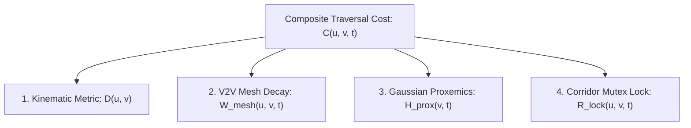

# Methodology & Mathematical Formulation: The $\text{D}^2\text{RO}$ Framework
## Socially-Weighted Distributed Graph Optimization (SW-DGO) for Autonomous Fleet Navigation

**Abstract / Overview:**
This document details the formal mathematical model, system architecture, and algorithmic execution of the Distributed Dynamic Route Optimization ($\text{D}^2\text{RO}$) framework. Designed for autonomous mobile shopping trolleys (*Int-Cart*) operating in crowded, narrow, and dynamic retail environments, $\text{D}^2\text{RO}$ synthesizes incremental heuristic search ($D^*$ Lite), event-driven Vehicle-to-Vehicle (V2V) ad-hoc mesh communication, continuous 2D anisotropic Gaussian human proxemics, and spatiotemporal directional corridor mutex locks.

---

## 1. Problem Formulation & System Modeling

### 1.1 Planar Retail Workspace and Roadmap Graph
Let $\mathcal{W} \subset \mathbb{R}^2$ define the continuous 2D planar supermarket floor. The navigation topology is modeled as an embedded directed graph:

$$G = (V, E)$$

where:
* $V = \{v_1, v_2, \dots, v_{|V|}\}$ is the set of waypoint vertices positioned at aisle junctions, shelf corners, and docking stations, with physical coordinates $\mathbf{p}_v = [x_v, y_v]^T \in \mathbb{R}^2$.
* $E \subseteq V \times V$ is the set of directed edges representing corridor traversals.
* $E_{\text{single-file}} \subset E$ denotes narrow single-file corridors where passage width $w_{\text{aisle}} < 2 r_{\text{trolley}}$, rendering bidirectional passing kinematically infeasible.

### 1.2 Agent Kinematics & Fleet State
The system manages a decentralized fleet of $N$ autonomous mobile trolleys $\mathcal{A} = \{a_1, a_2, \dots, a_N\}$. Each trolley $a_i$ operates under unicycle non-holonomic kinematics:

$$\mathbf{x}_i(t) = \begin{bmatrix} x_i(t) \\ y_i(t) \\ \theta_i(t) \\ v_i(t) \end{bmatrix}, \quad \dot{\mathbf{x}}_i(t) = \begin{bmatrix} v_i(t) \cos \theta_i(t) \\ v_i(t) \sin \theta_i(t) \\ \omega_i(t) \\ a_i(t) \end{bmatrix}$$

where:
* $\mathbf{p}_i(t) = [x_i(t), y_i(t)]^T$ is the 2D Cartesian position,
* $\theta_i(t) \in [-\pi, \pi)$ is the orientation heading angle,
* $v_i(t) \in [0, v_{\max}]$ and $\omega_i(t) \in [-\omega_{\max}, \omega_{\max}]$ are the linear and angular velocities,
* $a_i(t) \in [-a_{\max}, a_{\max}]$ is the linear acceleration command.

### 1.3 Dynamic Human Shoppers
The environment contains $M(t)$ dynamic human shoppers $\mathcal{H}(t) = \{h_1, h_2, \dots, h_M\}$. Each shopper $h_j$ is defined by:

$$\mathbf{h}_j(t) = \begin{bmatrix} \mathbf{p}_j^h(t) \\ \mathbf{v}_j^h(t) \end{bmatrix} = \begin{bmatrix} x_j^h(t) \\ y_j^h(t) \\ v_j^h \cos \phi_j^h \\ v_j^h \sin \phi_j^h \end{bmatrix}$$

where $\mathbf{p}_j^h(t)$ is position and $\phi_j^h$ is the walking direction.

---

## 2. The SW-DGO Optimization Objective

The fleet navigation goal for each agent $a_i$ moving from start waypoint $s_{\text{start}}$ to docking goal $s_{\text{goal}}$ is formulated as finding the optimal sequence of waypoints $\pi^* = (v_0, v_1, \dots, v_K)$ that minimizes the cumulative dynamic cost:

$$\pi^* = \arg\min_{\pi \in \Pi(s_{\text{start}}, s_{\text{goal}})} \sum_{k=0}^{|\pi|-1} C(v_k, v_{k+1}, t_k)$$

### 2.1 The Composite Edge Cost Function
For any directed edge $(u, v) \in E$ at time $t$, the traversal cost $C(u, v, t)$ is defined by four decoupled penalty functions:

$$\boxed{C(u, v, t) = D(u, v) + W_{\text{mesh}}(u, v, t) + H_{\text{prox}}(v, t) + R_{\text{lock}}(u, v, t)}$$



---

## 3. Mathematical Formulation of Cost Terms

### 3.1 Baseline Kinematic Metric $D(u, v)$
Penalizes Euclidean geometric distance and orientation changes required to align with edge $(u, v)$:

$$D(u, v) = \|\mathbf{p}_u - \mathbf{p}_v\|_2 + \alpha_{\text{turn}} \cdot |\Delta \theta(u, v)|$$

where:
* $\|\mathbf{p}_u - \mathbf{p}_v\|_2 = \sqrt{(x_u - x_v)^2 + (y_u - y_v)^2}$,
* $\Delta \theta(u, v) = |\text{atan2}(y_v - y_u, x_v - x_u) - \theta_i|$,
* $\alpha_{\text{turn}} \ge 0$ is a scalar tuning parameter penalizing rotational deceleration.

---

### 3.2 Spatiotemporal V2V Mesh Congestion $W_{\text{mesh}}(u, v, t)$
When an agent $a_k$ encounters a localized corridor blockage or fallen object at time $t_0$, it broadcasts an event-driven `CONGESTION_ALERT` packet with initial penalty $\Gamma_{\text{block}}$ across the ad-hoc mesh network.

#### 3.2.1 Temporal Exponential Decay
Because retail blockages and crowd stalls are temporary, the penalty decays exponentially:

$$W_{\text{mesh}}(u, v, t) = \max \left( 0, \; W_{\text{mesh}}(u, v, t_0) \cdot \exp\left( -\lambda_{\text{decay}} (t - t_0) \right) \right)$$

where $\lambda_{\text{decay}} > 0$ is the temporal decay rate.

#### 3.2.2 Multi-Hop Attenuation
For packets received via $h$-hop mesh relay ($h \in \{0, 1, \dots, \text{TTL}\}$):

$$W_{\text{mesh}}^{(h)}(u, v, t) = \gamma^h \cdot W_{\text{mesh}}^{(0)}(u, v, t), \quad \gamma \in (0, 1]$$

where $\gamma$ is the spatial confidence discount per relay hop.

---

### 3.3 2D Anisotropic Gaussian Human Proxemics $H_{\text{prox}}(v, t)$
Based on Hall’s Proxemic Theory and HA-VLN 2.0 social compliance standards, each human possesses an asymmetric personal space bubble.

#### 3.3.1 Continuous Anisotropic Gaussian Field
For human $h_j$ at $\mathbf{p}_j^h$ with heading $\phi_j^h$, the discomfort field at coordinate $\mathbf{p} = [x, y]^T$ is:

$$H_j(\mathbf{p}, t) = A_j \cdot \exp \left( -\frac{1}{2} (\mathbf{p} - \mathbf{p}_j^h)^T \mathbf{R}(\phi_j^h) \mathbf{\Sigma}_j^{-1} \mathbf{R}(\phi_j^h)^T (\mathbf{p} - \mathbf{p}_j^h) \right)$$

where:
* $A_j > 0$ is the peak discomfort amplitude,
* $\mathbf{R}(\phi_j^h) = \begin{bmatrix} \cos \phi_j^h & -\sin \phi_j^h \\ \sin \phi_j^h & \cos \phi_j^h \end{bmatrix}$ is the 2D coordinate rotation matrix,
* $\mathbf{\Sigma}_j = \text{diag}(\sigma_{\text{front}}^2, \sigma_{\text{side}}^2)$ is the diagonal covariance matrix with $\sigma_{\text{front}} \ge \sigma_{\text{side}} = \sigma_{\text{rear}}$, capturing the forward projection of personal space during motion.

#### 3.3.2 Aggregate Waypoint Proxemic Penalty
$$H_{\text{prox}}(v, t) = \sum_{j=1}^{M(t)} H_j(\mathbf{p}_v, t)$$

#### 3.3.3 Edge Integral Formulation
$$H_{\text{prox}}^{\text{edge}}(u, v, t) = \int_0^1 \sum_{j=1}^{M(t)} H_j\left((1 - \tau)\mathbf{p}_u + \tau \mathbf{p}_v, t\right) \, d\tau$$

---

### 3.4 Spatiotemporal Directional Corridor Lock $R_{\text{lock}}(u, v, t)$
To prevent head-on live-locks in narrow single-file aisles ($w_{\text{aisle}} < 2 r_{\text{trolley}}$):

Let $\mathcal{L}_k(u, v, t) \in \{0, 1\}$ denote whether agent $a_k$ holds an active lock on edge $(u, v)$ at time $t$.

$$R_{\text{lock}}(u, v, t) = \begin{cases} \infty & \text{if } \exists k \neq i : \mathcal{L}_k(v, u, t) = 1 \text{ and } t < t_{\text{expiry}} \\ 0 & \text{otherwise} \end{cases}$$

#### 3.4.1 Deadlock-Freedom Mutex Invariant
$$\forall (u, v) \in E_{\text{single-file}}, \quad \sum_{k=1}^N \left( \mathcal{L}_k(u, v, t) + \mathcal{L}_k(v, u, t) \right) \le 1, \quad \forall t \ge 0$$

**Theorem (Deadlock-Freedom):** *Under the corridor lock invariant, no two trolleys can enter the same single-file aisle in opposite directions simultaneously, eliminating narrow corridor live-locks.*

---

## 4. Incremental Search Dynamics ($D^*$ Lite Integration)

Each trolley maintains two vertex value functions:
* $g(s)$: Current estimate of shortest path distance from $s$ to $s_{\text{goal}}$.
* $rhs(s)$: One-step lookahead cost based on successor values:

$$rhs(s) = \begin{cases} 0 & \text{if } s = s_{\text{goal}} \\ \min_{s' \in \text{Succ}(s)} \left( C(s, s', t) + g(s') \right) & \text{otherwise} \end{cases}$$

### 4.1 Inconsistency & Dynamic Key Tuple
A vertex $s$ is consistent if $g(s) = rhs(s)$, and inconsistent if $g(s) \neq rhs(s)$. Inconsistent vertices are prioritized in queue $U$ by key tuple $\mathbf{k}(s) = [k_1(s), k_2(s)]^T$:

$$\begin{aligned}
k_1(s) &= \min(g(s), rhs(s)) + \|\mathbf{p}_{s_{\text{start}}} - \mathbf{p}_s\|_2 + k_m \\
k_2(s) &= \min(g(s), rhs(s))
\end{aligned}$$

where:
$$k_m \leftarrow k_m + \|\mathbf{p}_{s_{\text{last}}} - \mathbf{p}_{s_{\text{start}}}\|_2$$

The scalar key shift accumulator $k_m$ preserves key ordering across agent movements without requiring full queue re-heapification ($O(|U|)$).

---

## 5. Algorithmic Pseudocode

```text
Algorithm D2RO_ControlLoop(agent_i, s_goal)
1:  s_start ← GetNearestNode(current_pose)
2:  s_last ← s_start; km ← 0
3:  InitializeDStarLite(s_goal)
4:  ComputeShortestPath()
5:
6:  while s_start ≠ s_goal do
7:      // 1. Process V2V Mesh Packets
8:      changed_edges ← IngestInboundMeshPackets()
9:
10:     // 2. Local Perception & Gaussian Proxemics
11:     for each edge (u, v) in SensorRange() do
12:         h_val ← ComputeGaussianProxemicField(v, LocalHumans())
13:         if |h_val - edge.h_prox| > ε then
14:             edge.h_prox ← h_val
15:             changed_edges.Add((u, v))
16:         end if
17:     end for
18:
19:     // 3. Incremental D* Lite Replanning
20:     if changed_edges is not empty then
21:         km ← km + EuclideanDist(s_last, s_start)
22:         s_last ← s_start
23:         for each (u, v) in changed_edges do
24:             UpdateVertex(u)
25:         end for
26:         ComputeShortestPath()
27:     end if
28:
29:     // 4. Waypoint Navigation & Corridor Locking
30:     s_next ← GetNextWaypoint()
31:     if IsSingleFile(s_start, s_next) and not HasLock(s_start, s_next) then
32:         if OpposingLockHeld(s_next, s_start) then
33:             r_lock(s_start, s_next) ← ∞
34:             UpdateVertex(s_start)
35:             ComputeShortestPath()
36:             continue
37:         else
38:             AcquireLock(s_start, s_next)
39:         end if
40:     end if
41:
42:     // 5. Kinematic Execution
43:     StepKinematicsTowards(s_next)
44:     if ArrivedAt(s_next) then
45:         ReleaseLock(s_start, s_next)
46:         s_start ← s_next
47:     end if
48: end while
```

---

## 6. Computational & Communication Complexity

| Metric | Traditional Static $A^*$ | Reactive Avoidance (ORCA) | $\text{D}^2\text{RO}$ (SW-DGO) |
| :--- | :--- | :--- | :--- |
| **Replan Time Complexity** | $O(|V| \log |V| + |E|)$ (Full graph) | $O(N)$ (Local neighbors only) | **$O(k \log |V|)$ where $k \ll |V|$** |
| **Communication Overhead** | $O(N \cdot B)$ (Continuous server stream) | $0$ (No communication) | **$O(E_{\text{alert}} \cdot \text{deg}(v) \cdot \text{TTL})$ (Event-driven)** |
| **Corridor Deadlock Rate** | High in dynamic crowds | High (100% in narrow aisles) | **0% (Guaranteed by Mutex $R_{\text{lock}}$)** |
| **Social Compliance** | Non-compliant (rigid walls) | Low (aggressive local weaving) | **High (Continuous Gaussian Fields)** |
