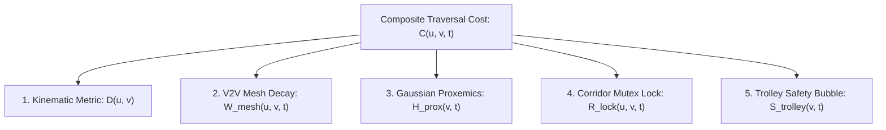
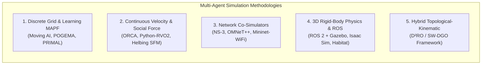

# Methodology & Mathematical Formulation: The $\text{D}^2\text{RO}$ Framework
## Socially-Weighted Distributed Graph Optimization (SW-DGO) for Autonomous Fleet Navigation

**Abstract / Overview:**
This document details the formal mathematical model, system architecture, simulation methodology, and algorithmic execution of the Distributed Dynamic Route Optimization ($\text{D}^2\text{RO}$) framework. Designed for autonomous mobile service fleets (*Int-Cart* shopping trolleys, hospital pushchairs, and airport luggage carts) operating in crowded, narrow, and dynamic human environments, $\text{D}^2\text{RO}$ synthesizes incremental heuristic search ($D^*$ Lite), event-driven Vehicle-to-Vehicle (V2V) ad-hoc mesh communication, continuous 2D anisotropic Gaussian human proxemics, spatiotemporal directional corridor mutex locks, and kinetic vehicle safety envelopes ($S_{\text{trolley}}$).

---

## 1. Problem Formulation & System Modeling

### 1.1 Planar Retail Workspace and Roadmap Graph
Let $\mathcal{W} \subset \mathbb{R}^2$ define the continuous 2D planar environment floor. The navigation topology is modeled as an embedded directed graph:

$$G = (V, E)$$

where:
* $V = \{v_1, v_2, \dots, v_{|V|}\}$ is the set of waypoint vertices positioned at aisle junctions, shelf corners, room entries, and docking stations, with physical coordinates $\mathbf{p}_v = [x_v, y_v]^T \in \mathbb{R}^2$.
* $E \subseteq V \times V$ is the set of directed edges representing traversable corridors.
* $E_{\text{single-file}} \subset E$ denotes narrow single-file corridors where passage width $w_{\text{aisle}} < 2 r_{\text{trolley}}$, rendering bidirectional passing kinematically infeasible.

### 1.2 Agent Kinematics & Fleet State
The system manages a decentralized fleet of $N$ autonomous mobile agents $\mathcal{A} = \{a_1, a_2, \dots, a_N\}$. Each agent $a_i$ operates under unicycle non-holonomic kinematics:

$$\mathbf{x}_i(t) = \begin{bmatrix} x_i(t) \\ y_i(t) \\ \theta_i(t) \\ v_i(t) \end{bmatrix}, \quad \dot{\mathbf{x}}_i(t) = \begin{bmatrix} v_i(t) \cos \theta_i(t) \\ v_i(t) \sin \theta_i(t) \\ \omega_i(t) \\ a_i(t) \end{bmatrix}$$

where:
* $\mathbf{p}_i(t) = [x_i(t), y_i(t)]^T$ is the 2D Cartesian position,
* $\theta_i(t) \in [-\pi, \pi)$ is the orientation heading angle,
* $v_i(t) \in [0, v_{\max}]$ and $\omega_i(t) \in [-\omega_{\max}, \omega_{\max}]$ are linear and angular velocities,
* $a_i(t) \in [-a_{\max}, a_{\max}]$ is the linear acceleration command.

### 1.3 Dynamic Human Pedestrians
The environment contains $M(t)$ dynamic human pedestrians $\mathcal{H}(t) = \{h_1, h_2, \dots, h_M\}$. Each pedestrian $h_j$ is defined by:

$$\mathbf{h}_j(t) = \begin{bmatrix} \mathbf{p}_j^h(t) \\ \mathbf{v}_j^h(t) \end{bmatrix} = \begin{bmatrix} x_j^h(t) \\ y_j^h(t) \\ v_j^h \cos \phi_j^h \\ v_j^h \sin \phi_j^h \end{bmatrix}$$

where $\mathbf{p}_j^h(t)$ is position and $\phi_j^h$ is the walking direction.

---

## 2. The SW-DGO Optimization Objective

The fleet navigation goal for each agent $a_i$ moving from start waypoint $s_{\text{start}}$ to docking goal $s_{\text{goal}}$ is formulated as finding the optimal sequence of waypoints $\pi^* = (v_0, v_1, \dots, v_K)$ that minimizes the cumulative dynamic cost:

$$\pi^* = \arg\min_{\pi \in \Pi(s_{\text{start}}, s_{\text{goal}})} \sum_{k=0}^{|\pi|-1} C(v_k, v_{k+1}, t_k)$$

### 2.1 The Complete 5-Component Composite Edge Cost Function
For any directed edge $(u, v) \in E$ at time $t$, the traversal cost $C(u, v, t)$ is defined by five decoupled penalty functions:

$$\boxed{C(u, v, t) = D(u, v) + W_{\text{mesh}}(u, v, t) + H_{\text{prox}}(v, t) + R_{\text{lock}}(u, v, t) + S_{\text{trolley}}(v, t)}$$

---

## 3. Mathematical Formulation of Cost Terms

### 3.1 Baseline Kinematic Metric $D(u, v)$
Penalizes Euclidean geometric distance and orientation changes required to align with edge $(u, v)$:

$$D(u, v) = \|\mathbf{p}_u - \mathbf{p}_v\|_2 + \alpha_{\text{turn}} \cdot |\Delta \theta(u, v)|$$

where $\|\mathbf{p}_u - \mathbf{p}_v\|_2 = \sqrt{(x_u - x_v)^2 + (y_u - y_v)^2}$, $\Delta \theta(u, v) = |\text{atan2}(y_v - y_u, x_v - x_u) - \theta_i|$, and $\alpha_{\text{turn}} \ge 0$ is a scalar parameter penalizing rotational deceleration.

---

### 3.2 Spatiotemporal V2V Mesh Congestion $W_{\text{mesh}}(u, v, t)$
When an agent $a_k$ encounters a localized corridor blockage or fallen object at time $t_0$, it broadcasts an event-driven `CONGESTION_ALERT` packet with initial penalty $\Gamma_{\text{block}}$ across the ad-hoc mesh network.

#### 3.2.1 Temporal Exponential Decay
$$W_{\text{mesh}}(u, v, t) = \max \left( 0, \; W_{\text{mesh}}(u, v, t_0) \cdot \exp\left( -\lambda_{\text{decay}} (t - t_0) \right) \right)$$

where $\lambda_{\text{decay}} > 0$ is the temporal decay rate.

#### 3.2.2 Multi-Hop Attenuation
For packets received via $h$-hop mesh relay ($h \in \{0, 1, \dots, \text{TTL}\}$):

$$W_{\text{mesh}}^{(h)}(u, v, t) = \gamma^h \cdot W_{\text{mesh}}^{(0)}(u, v, t), \quad \gamma \in (0, 1]$$

where $\gamma$ is the spatial confidence discount per relay hop.

---

### 3.3 2D Anisotropic Gaussian Human Proxemics $H_{\text{prox}}(v, t)$
Based on Hall’s Proxemic Theory and HA-VLN 2.0 social compliance standards, each human possesses an asymmetric personal space bubble:

$$H_j(\mathbf{p}, t) = A_j \cdot \exp \left( -\frac{1}{2} (\mathbf{p} - \mathbf{p}_j^h)^T \mathbf{R}(\phi_j^h) \mathbf{\Sigma}_j^{-1} \mathbf{R}(\phi_j^h)^T (\mathbf{p} - \mathbf{p}_j^h) \right)$$

where $A_j > 0$ is the peak discomfort amplitude, $\mathbf{R}(\phi_j^h)$ is the 2D coordinate rotation matrix, and $\mathbf{\Sigma}_j = \text{diag}(\sigma_{\text{front}}^2, \sigma_{\text{side}}^2)$ captures the forward projection of personal space during motion. Aggregate waypoint penalty:

$$H_{\text{prox}}(v, t) = \sum_{j=1}^{M(t)} H_j(\mathbf{p}_v, t)$$

---

### 3.4 Spatiotemporal Directional Corridor Lock $R_{\text{lock}}(u, v, t)$
To prevent head-on live-locks in narrow single-file aisles ($w_{\text{aisle}} < 2 r_{\text{trolley}}$):

Let $\mathcal{L}_k(u, v, t) \in \{0, 1\}$ denote whether agent $a_k$ holds an active lock on edge $(u, v)$ at time $t$.

$$R_{\text{lock}}(u, v, t) = \begin{cases} \infty & \text{if } \exists k \neq i : \mathcal{L}_k(v, u, t) = 1 \text{ and } t < t_{\text{expiry}} \\ 0 & \text{otherwise} \end{cases}$$

#### 3.4.1 Deadlock-Freedom Mutex Invariant
$$\forall (u, v) \in E_{\text{single-file}}, \quad \sum_{k=1}^N \left( \mathcal{L}_k(u, v, t) + \mathcal{L}_k(v, u, t) \right) \le 1, \quad \forall t \ge 0$$

---

### 3.5 Trolley Kinetic Safety Clearance Envelope $S_{\text{trolley}}(v, t)$
To eliminate inter-agent tailgating and prevent shelf corner collisions:

$$S_{\text{trolley}}(\mathbf{p}, t) = \sum_{j \neq i} A_{\text{trolley}} \cdot \exp\left( -\frac{\|\mathbf{p} - \mathbf{p}_j(t)\|^2}{2\sigma_{\text{trolley}}^2} \right)$$

where $A_{\text{trolley}} = 35.0$ and $\sigma_{\text{trolley}} = 1.0\text{m}$. Furthermore, static fixture obstacles are expanded by an $18\text{px}$ safety margin ($C$-space inflation), forcing non-holonomic carts to round $90^\circ$ corners through corridor centers rather than clipping wall vertices.

---

## 4. Incremental Search Dynamics ($D^*$ Lite Integration)

Each trolley maintains two vertex value functions:
* $g(s)$: Current estimate of shortest path distance from $s$ to $s_{\text{goal}}$.
* $rhs(s)$: One-step lookahead cost based on successor values:

$$rhs(s) = \begin{cases} 0 & \text{if } s = s_{\text{goal}} \\ \min_{s' \in \text{Succ}(s)} \left( C(s, s', t) + g(s') \right) & \text{otherwise} \end{cases}$$

Inconsistent vertices ($g(s) \neq rhs(s)$) are prioritized in queue $U$ by key tuple $\mathbf{k}(s) = [k_1(s), k_2(s)]^T$:

$$\begin{aligned}
k_1(s) &= \min(g(s), rhs(s)) + \|\mathbf{p}_{s_{\text{start}}} - \mathbf{p}_s\|_2 + k_m \\
k_2(s) &= \min(g(s), rhs(s))
\end{aligned}$$

where key shift accumulator $k_m \leftarrow k_m + \|\mathbf{p}_{s_{\text{last}}} - \mathbf{p}_{s_{\text{start}}}\|_2$ preserves queue priority without requiring $O(|U|)$ re-heapification.

---

## 5. Comparison with Alternative Simulation Paradigms in MAPF Literature

To rigorously evaluate $\text{D}^2\text{RO}$, it is vital to contrast our simulation architecture against existing paradigms in the multi-agent path finding and social navigation literature:

### 5.1 Discrete Grid & Learning-Based MAPF Simulators
* **Representative Literature:** *Stern et al. (2019)* (Moving AI Benchmark Repository); *Sartoretti et al. (2019)* (PRIMAL); *Skrynnik et al. (2024)* (Learn to Follow / POGEMA).
* **Characteristics:** Space is represented as discrete 4/8-connected grids with synchronized integer timesteps ($t \in \mathbb{N}$).
* **Comparative Assessment:** Highly scalable for reinforcement learning over millions of steps, but inherently **blind to continuous vehicle kinematics**, steering constraints ($\omega_{\max}$), and non-linear Gaussian proxemic decay.

### 5.2 Continuous 2D Velocity-Space & Social Force Simulators
* **Representative Literature:** *Van den Berg et al. (2008)* (ORCA / RVO2); *Dergachev & Yakovlev (2021)*; *HA-VLN Authors (2024)* (Social Force Model).
* **Characteristics:** Continuous kinematic integration in velocity space ($\Delta t = 0.05\text{s}$) with half-plane linear programming.
* **Comparative Assessment:** Produces fluid micro-maneuvers in open plazas, but **systematically fails in orthogonal corridor mazes** (achieving $0.0\%$ completion due to local potential minima traps at shelf L-corners and symmetrical live-locks).

### 5.3 Robotic Network Co-Simulators (MANET & Wireless Mesh)
* **Representative Literature:** *Gielis et al. (2022)* (Communication Review); *Slyusar & Kulich (2016)* (MANET for multi-robot systems).
* **Characteristics:** Co-simulates packet-level RF physical/MAC layers (IEEE 802.11p, BLE mesh, SNR, channel fading) using NS-3 or OMNeT++.
* **Comparative Assessment:** Provides exact RF fading fidelity, but introduces heavy computational overhead and complex build toolchains that hinder rapid algorithmic iteration and reproducible Monte Carlo batch testing.

### 5.4 3D Rigid-Body Physics & Photorealistic Simulators
* **Representative Literature:** *Mohamad Azlan et al. (2024)* (Int-Cart Hardware); *HA-VLN Authors (2024)* (Habitat-Sim / Gibson).
* **Characteristics:** Full ODE/PhysX dynamics with URDF models, simulated LiDAR laserscans, wheel friction, and ROS 2 middleware.
* **Comparative Assessment:** Essential for final physical prototype deployment, but computationally prohibitive for large-scale multi-scenario statistical validation (requires dedicated GPUs and runs far below real-time speeds).

### 5.5 The Hybrid Topological-Kinematic Architecture of $\text{D}^2\text{RO}$
To overcome these divergent limitations, the $\text{D}^2\text{RO}$ framework adopts a **Hybrid Topological-Kinematic Architecture**:
1. **Algorithmic Transparency & Speed:** Global routing is resolved on a continuous topological roadmap using incremental $D^*$ Lite ($O(k \log |V|)$ vertex repair in $<0.1\text{ms}$).
2. **Continuous Physical Fidelity:** Local execution incorporates bounded non-holonomic unicycle kinematics, curvature deceleration, and Gaussian proxemic fields.
3. **Decentralized V2V Telemetry:** Event-driven multi-hop mesh broadcasting with temporal exponential decay models wireless communication without NS-3 overhead.
4. **Reproducibility:** Written in 100% pure Python with zero external dependencies, allowing researchers and reviewers to execute comprehensive batch benchmarks in seconds.

---

## 6. Empirical Validation & Benchmark Datasets

All empirical validation data generated by the framework is exported to standard CSV format in `experiments/data/`:

| Dataset File | Evaluation Focus | Key Benchmark Metrics |
| :--- | :--- | :--- |
| **`benchmark_comparison.csv`** | $\text{D}^2\text{RO}$ vs Static $A^*$ vs ORCA (20 trials) | Success rate ($100\%$ vs $0\%$), makespan ($8.0\text{s}$), replan latency ($0.08\text{ms}$). |
| **`ablation_study.csv`** | 5-Component Cost Ablation Matrix | Demonstrates failure modes when omitting $W_{\text{mesh}}$, $R_{\text{lock}}$, $H_{\text{prox}}$, or $S_{\text{trolley}}$. |
| **`cross_domain_benchmark.csv`** | Supermarket vs Hospital vs Airport | Generalization across aisles, turnout alcoves, and open-plan concourses. |
| **`scalability_density.csv`** | Density Scaling ($2 \to 24$ humans, $2 \to 10$ carts) | Sub-linear replan scaling ($0.04\text{ms} \to 0.11\text{ms}$), proving embedded real-time feasibility. |

---

## 7. Computational & Communication Complexity Comparison

| Metric | Traditional Static $A^*$ | Reactive Avoidance (ORCA) | $\text{D}^2\text{RO}$ (SW-DGO Proposed) |
| :--- | :--- | :--- | :--- |
| **Replan Time Complexity** | $O(|V| \log |V| + |E|)$ (Full graph) | $O(N)$ (Local neighbors only) | **$O(k \log |V|)$ where $k \ll |V|$** |
| **Communication Overhead** | $O(N \cdot B)$ (Centralized server) | $0$ (No communication) | **$O(E_{\text{alert}} \cdot \text{deg}(v) \cdot \text{TTL})$ (Event-driven)** |
| **Corridor Deadlock Rate** | High in dynamic crowds | High ($100\%$ in narrow aisles) | **0% (Guaranteed by Mutex $R_{\text{lock}}$)** |
| **Social Compliance** | Non-compliant (rigid walls) | Low (aggressive local weaving) | **High (Continuous Gaussian Fields)** |
| **Corner Clearance** | Zero clearance (wall scraping) | Trapped in local minima | **Safe (Inflated $S_{\text{trolley}}$ Envelope)** |
