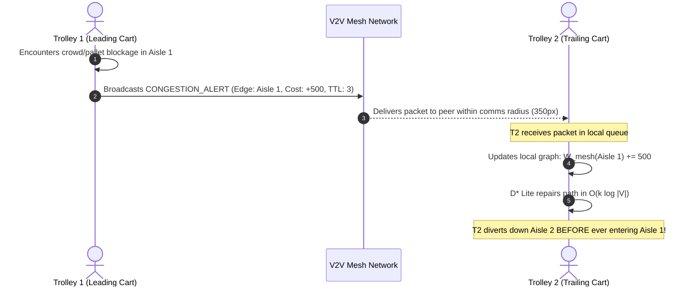

**Yes, absolutely!** This is one of the core contributions of the $\text{D}^2\text{RO}$ (SW-DGO) algorithm: **Decentralized V2V (Vehicle-to-Vehicle) Mesh Communication**.

When one trolley discovers a blockage, human crowd, or narrow corridor encounter, it **does not keep that information to itself**—it immediately broadcasts a wireless packet to all neighboring peer trolleys so they can divert **before** they reach the blocked area.

---

### How V2V Mesh Communication Works



---

### 1. The Mathematical Cost Term: $W_{\text{mesh}}(u, v, t)$

$$C(u, v, t) = D(u, v) + \mathbf{W_{\text{mesh}}(u, v, t)} + H_{\text{prox}}(v, t) + R_{\text{lock}}(u, v, t)$$

* When a trolley encounters a slowdown, it broadcasts an alert.
* For all peer carts, the cost $W_{\text{mesh}}$ on that corridor immediately inflates (e.g., $+500.0$).
* **Temporal Decay:** As time passes, the mesh penalty gradually decays ($W(t) = W_0 \cdot e^{-\lambda t}$) so corridors automatically become available again once the crowd disperses.

---

### 2. The 3 Types of Mesh Packets Exchanged

Implemented in [`mesh_network.py`](file:///c:/Users/Polla/Desktop/Researches/D2RO/sw_dgo_framework/core/mesh_network.py):

| Packet Type | When It Is Broadcast | Effect on Peer Trolleys |
| :--- | :--- | :--- |
| **`CONGESTION_ALERT`** | A cart is blocked by shoppers or an obstacle for $> 0.9$s. | Trailing carts reroute through adjacent open aisles before reaching the bottleneck. |
| **`LOCK_REQUEST`** | A cart commits to entering a single-file corridor. | Opposing carts detect the lock and wait or take an alternate corridor. |
| **`LOCK_RELEASE`** | The cart exits the single-file corridor. | Unlocks the corridor for waiting peer carts. |

---

### 3. How to See It Live

1. **Test Scenario C (Sudden V2V Blockage) in any simulator:**
   ```powershell
   python -m sw_dgo_framework.run_simulation
   ```
   * Click **Scenario C**.
   * Trolley 1 discovers the blocked aisle and broadcasts a `CONGESTION_ALERT`.
   * Watch **Trolley 2's colored path line instantly flip** to the adjacent aisle before Trolley 2 ever enters the blocked aisle!

2. **Watch the Telemetry Bar:**
   * Look at `Mesh Pkts: X` in the bottom-right bar. You will see the packet counter incrementing in real time as carts coordinate.

3. **Interactive Click-to-Block:**
   * **Left-click on any corridor** during the simulation. It will broadcast a dynamic mesh alert, and all nearby carts will immediately alter their paths around your click!

Ran command: `python -m sw_dgo_framework.run_airport_simulation
python -m sw_dgo_framework.run_airport_simulation`