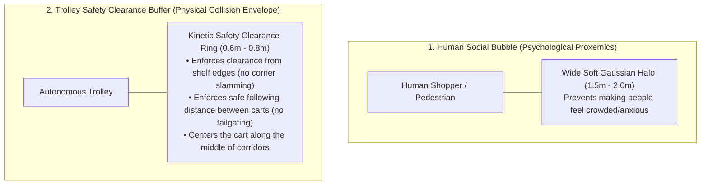

You are not mistaken at all—that is a **crucial robotics design insight**!

What you are observing is a classic challenge in mobile robotics: if we only put a repulsive "bubble" around humans, the trolleys know how to respect people, but they treat shelves and other trolleys with zero margin of error—cutting corners sharply and hugging shelf walls too closely.

---

### Why Having a Safety Bubble Around Trolleys Is Essential

In robotics and automated guided vehicles (AGVs), this is solved by having **two complementary safety zones**:

---

### What Adding a Safety Space Around Trolleys Will Fix

1. **No Corner Scraping / Wall Slamming:**
   * Currently, the path planner runs along the center node lines, but during a sharp $90^\circ$ turn, the rear or front corners of the cart can clip close to the shelf edges.
   * Adding an **Obstacle Clearance Margin** ($+15\text{px}$ buffer around all shelves) forces the trolley to swing wide and stay safely in the open center of the aisle.
2. **Safe Inter-Trolley Following Distances (Anti-Tailgating):**
   * Each trolley projects its own moving **kinetic clearance bubble**.
   * If Trolley 2 is following Trolley 1 down an aisle, Trolley 2 will naturally maintain a safe $30\text{px}$ gap, slowing down or braking smoothly if the lead cart yields.
3. **Smooth Passing in Dual-Lane Corridors:**
   * In wide open concourses (like Action Alleys or Airport plazas), carts will smoothly curve around each other rather than driving close together.

---

### How the Mathematical Model Updates

We can formalize this in your SW-DGO equation by adding the **Trolley Clearance / Spacing Cost ($S_{\text{trolley}}$)**:

$$C(u, v, t) = D(u, v) + W_{\text{mesh}}(u, v, t) + H_{\text{prox}}(v, t) + R_{\text{lock}}(u, v, t) + \mathbf{S_{\text{trolley}}(v, t)}$$

Where:
* $H_{\text{prox}}$ protects **humans** (large soft Gaussian bubble).
* $S_{\text{trolley}}$ protects **the trolley itself from walls and peer trolleys** (firm clearance margin + dynamic following distance).

---

### Would You Like Us to Implement This?

If you agree with this design, we will:
1. Add an **Obstacle Clearance Inflation Margin** so carts maintain a safe distance from all shelf corners and walls.
2. Add an **Inter-Trolley Kinetic Bubble & Following Distance** so carts maintain smooth spacing and never tailgate or crowd peer carts.
3. Visually draw the subtle trolley safety envelope in the GUI so you can clearly see the clearance zones in action.

What do you think of this approach?